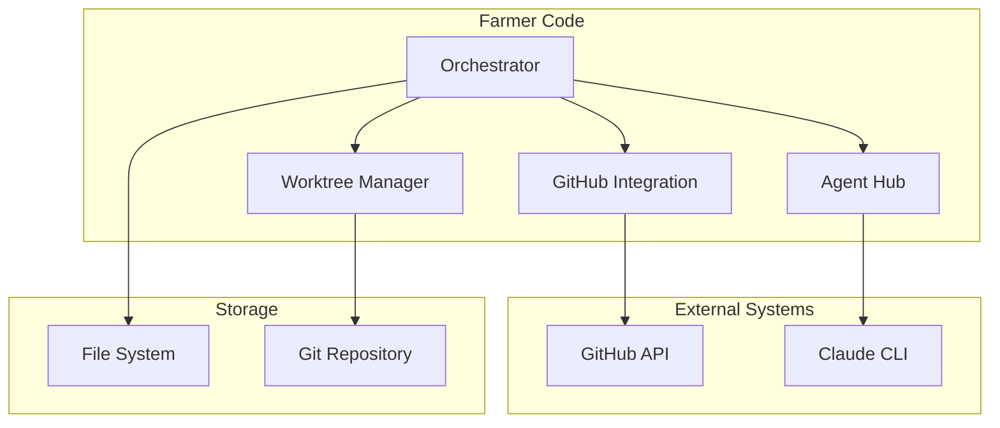
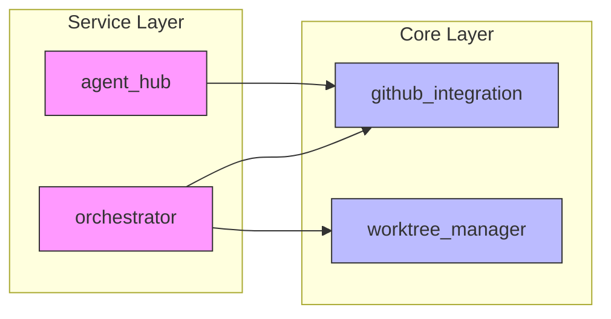

# Architecture Documentation

This section documents the system architecture, component interactions, and design decisions for Farmer Code.

## Contents

| Document | Description |
|----------|-------------|
| [System Overview](./system-overview.md) | High-level architecture and design principles |
| [Module Interactions](./module-interactions.md) | How modules communicate and depend on each other |
| [Agent Hub](./agent-hub.md) | Agent Hub service architecture |
| [Services](../services/README.md) | Microservices architecture (Feature 008) |
| [Diagrams](./diagrams/) | Visual architecture diagrams (Mermaid) |

## Architecture Principles

Farmer Code follows these architectural principles (from the [Constitution](../../.specify/memory/constitution.md)):

1. **Thin Client Architecture**: All business logic in backend, clients are presentation-only
2. **Local-First Design**: Primary deployment is local, cloud-ready as future option
3. **Services Architecture**: Independent services communicating via REST APIs
4. **Event-Driven State**: State machine manages workflow transitions
5. **Agent-Based Processing**: AI agents handle specialized tasks (Baron, Duc, Marie)

## System Context

## Module Dependency Graph

**Dependency Rules**:
- Core layer modules have no internal dependencies
- Service layer depends on core layer
- No circular dependencies allowed

## Key Design Decisions

### 1. State Machine for Workflow

**Decision**: Use explicit state machine for SDLC workflow management.

**Rationale**:
- Clear state transitions with guards
- Persistent state survives restarts
- Easy to add new phases or gates
- Enables parallel story execution

### 2. Agent-Based Architecture

**Decision**: Route questions and tasks to specialized AI agents.

**Rationale**:
- Domain expertise improves answer quality
- Configurable routing rules
- Confidence-based validation
- Human escalation for uncertain answers

### 3. Git Worktrees for Isolation

**Decision**: Each feature works in isolated git worktree.

**Rationale**:
- Prevents cross-feature conflicts
- Enables parallel feature development
- Clean main branch until merge
- Easy cleanup after completion

### 4. JSONL for Logging

**Decision**: Use append-only JSONL files for Q&A logging.

**Rationale**:
- Immutable audit trail
- Easy to process line-by-line
- Human-readable format
- Supports retrospective analysis

## Data Flow

See [Module Interactions](./module-interactions.md) for detailed data flow diagrams.

## Related Documentation

- [Modules](../modules/README.md) - Detailed module documentation
- [User Journeys](../user-journeys/JOURNEYS.md) - End-to-end workflows
- [Constitution](../../.specify/memory/constitution.md) - Development principles
