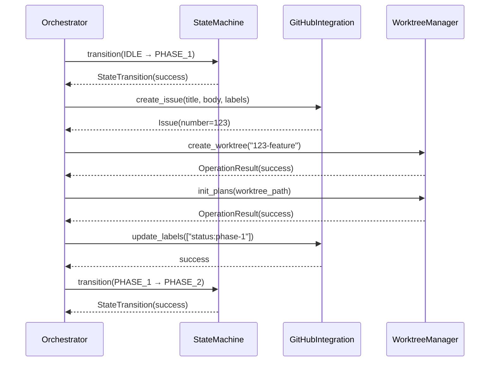
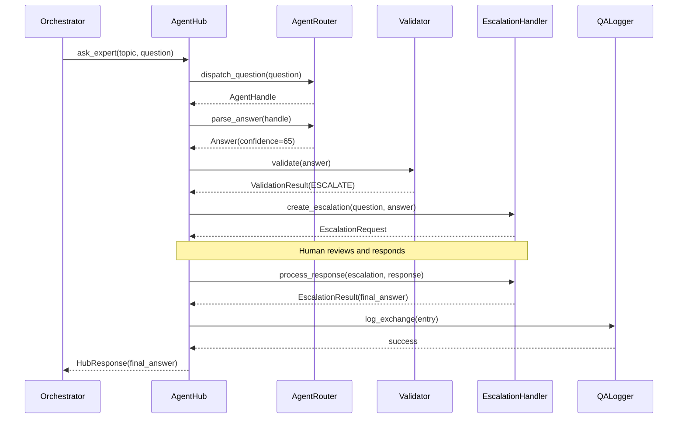

# Module Interactions

This document describes how Farmer Code modules interact with each other, including dependencies, interfaces, and data flow.

## Module Dependency Matrix

| Module | Depends On | Depended By |
|--------|------------|-------------|
| `github_integration` | (external: PyGithub) | `orchestrator`, `agent_hub` |
| `worktree_manager` | (external: git) | `orchestrator` |
| `orchestrator` | `github_integration`, `worktree_manager`, `agent_hub` | (top-level) |
| `agent_hub` | `github_integration` (optional) | `orchestrator` |

## Interaction Patterns

### 1. Orchestrator → GitHub Integration

The orchestrator uses GitHub Integration for all GitHub operations:

```python
# Issue creation during Phase 1
from github_integration import GitHubService

github = GitHubService.from_env()
issue = github.issues.create(
    title="Feature: Add authentication",
    body=spec_content,
    labels=["enhancement", "status:new"]
)

# Label sync during state transitions
github.issues.update_labels(
    issue_number=123,
    labels=["status:phase-2"]
)

# Comment posting for agent feedback
github.issues.add_comment(
    issue_number=123,
    body="Agent completed architecture review."
)
```

**Data Exchange**:
- Input: Issue metadata, comment content, label lists
- Output: Issue objects, comment objects, operation status

### 2. Orchestrator → Worktree Manager

The orchestrator uses Worktree Manager for isolated development environments:

```python
from worktree_manager import WorktreeService, CreateWorktreeRequest

worktree = WorktreeService(repo_path)

# Create feature worktree
result = worktree.create_worktree(
    CreateWorktreeRequest(
        branch_name="123-add-auth",
        worktree_path=Path("/worktrees/123-add-auth")
    )
)

# Initialize plans directory
worktree.init_plans(result.worktree_path)

# Cleanup after completion
worktree.delete_worktree(result.worktree_path)
```

**Data Exchange**:
- Input: Branch names, paths, commit messages
- Output: Worktree info, operation results

### 3. Orchestrator → Agent Hub

The orchestrator routes questions to appropriate expert agents:

```python
from agent_hub import AgentHub, ConfigLoader

config = ConfigLoader.load_from_file("config/routing.yaml")
hub = AgentHub(config, log_dir="logs/qa")

# Route architecture question
response = hub.ask_expert(
    topic="architecture",
    question="Which auth method should we use?",
    feature_id="005-auth"
)

if response.status.value == "resolved":
    answer = response.answer
else:
    # Low confidence - check escalation
    escalation = hub.check_escalation(response.escalation_id)
```

**Data Exchange**:
- Input: Questions with topic and context
- Output: Answers with confidence scores, escalation requests

### 4. Agent Hub → GitHub Integration (Optional)

Agent Hub can post escalation comments to GitHub:

```python
# Format escalation for GitHub
escalation = hub.check_escalation(escalation_id)

# Post to issue (via orchestrator or directly)
github.issues.add_comment(
    issue_number=feature_issue_number,
    body=escalation.format_comment()
)
```

## Data Flow Diagrams

### Phase 1 Execution



### Question Routing with Escalation



## Interface Contracts

### GitHub Integration Interface

```python
class GitHubService:
    """GitHub API wrapper."""

    @classmethod
    def from_env(cls) -> GitHubService: ...

    @property
    def issues(self) -> IssueService: ...

    @property
    def comments(self) -> CommentService: ...

class IssueService:
    def create(self, title: str, body: str, labels: list[str]) -> Issue: ...
    def update(self, issue_number: int, **kwargs) -> Issue: ...
    def update_labels(self, issue_number: int, labels: list[str]) -> None: ...
    def add_comment(self, issue_number: int, body: str) -> Comment: ...
```

### Worktree Manager Interface

```python
class WorktreeService:
    """Git worktree management."""

    def __init__(self, repo_path: Path): ...

    def create_worktree(self, request: CreateWorktreeRequest) -> OperationResult: ...
    def delete_worktree(self, path: Path) -> OperationResult: ...
    def init_plans(self, worktree_path: Path) -> OperationResult: ...
    def commit_and_push(self, request: CommitRequest) -> OperationResult: ...
```

### Agent Hub Interface

```python
class AgentHub:
    """Central coordination for agent interactions."""

    def __init__(self, config: RoutingConfig, log_dir: str | None = None): ...

    def ask_expert(self, topic: str, question: str, context: str = "",
                   feature_id: str = "", session_id: str | None = None) -> HubResponse: ...
    def check_escalation(self, escalation_id: str) -> EscalationRequest: ...
    def add_human_response(self, escalation_id: str, action: HumanAction,
                           responder: str, corrected_answer: str | None = None) -> EscalationResult: ...
    def get_session(self, session_id: str) -> Session: ...
    def close_session(self, session_id: str) -> None: ...
```

## Error Propagation

Errors flow upward through the module hierarchy:

```
External System Error
    ↓
Module-Specific Error (e.g., AgentTimeoutError)
    ↓
Orchestrator catches and handles
    ↓
State machine may transition to error state
    ↓
User notified via GitHub comment or UI
```

### Error Types by Module

| Module | Error Types |
|--------|-------------|
| `github_integration` | `GitHubAPIError`, `IssueNotFoundError`, `AuthenticationError` |
| `worktree_manager` | `BranchExistsError`, `WorktreeExistsError`, `GitCommandError` |
| `orchestrator` | `InvalidStateTransition`, `PhaseExecutionError`, `PollTimeoutError` |
| `agent_hub` | `UnknownTopicError`, `AgentDispatchError`, `AgentTimeoutError`, `EscalationError`, `SessionNotFoundError` |

## Thread Safety

- **State Machine**: Single-threaded, file-locked during writes
- **GitHub Operations**: Thread-safe (PyGithub handles internally)
- **Git Operations**: Process-based isolation via subprocess
- **Q&A Logging**: Append-only, one writer per feature

## Configuration Sharing

Modules read configuration from:

1. **Environment Variables**: API keys, credentials (`python-dotenv`)
2. **YAML Files**: Routing rules, agent definitions (`config/routing.yaml`)
3. **JSON Files**: State persistence (`.plans/{issue}/state.json`)
