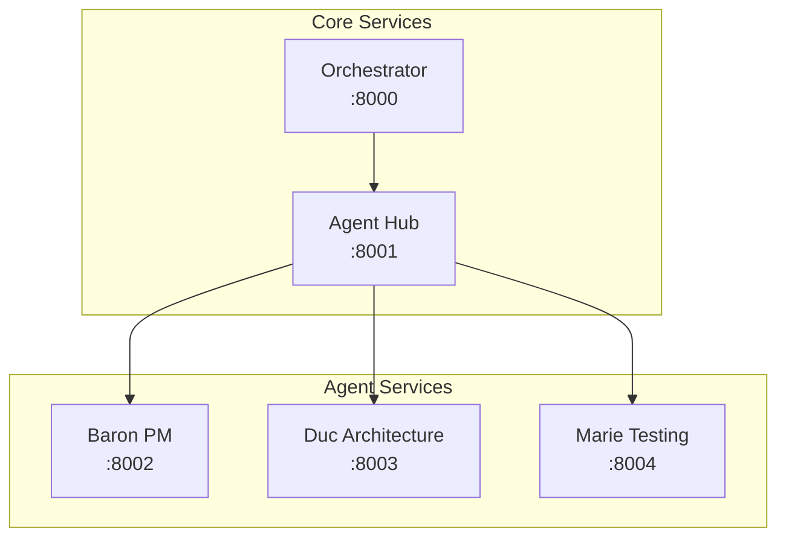

# Services Architecture

Farmer Code uses a microservices architecture with three main services and multiple agent services.

## Service Topology



## Port Assignments

| Service | Port | Purpose |
|---------|------|---------|
| Orchestrator | 8000 | Workflow state machine |
| Agent Hub | 8001 | Central coordination, routing, sessions |
| Baron | 8002 | PM agent (specify, plan, tasks) |
| Duc | 8003 | Architecture expert |
| Marie | 8004 | Testing expert |

## Communication Patterns

### Orchestrator → Agent Hub

The Orchestrator delegates all agent communication through Agent Hub:

```
POST /invoke/{agent_name}
POST /ask/{topic}
```

### Agent Hub → Agents

Agent Hub routes requests to the appropriate agent service:

```
POST /invoke  (to agent service)
GET /health   (health checks)
```

## Service Responsibilities

### Orchestrator

- Workflow state machine (specify → plan → tasks → implement)
- Feature ID generation
- Phase transitions and gates

### Agent Hub

- Request routing to agents
- Session management (multi-turn conversations)
- Confidence validation and escalation
- Audit logging

### Agent Services

- Stateless request processing
- Claude SDK integration
- Domain-specific expertise
