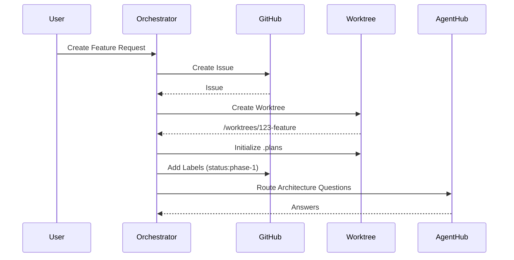
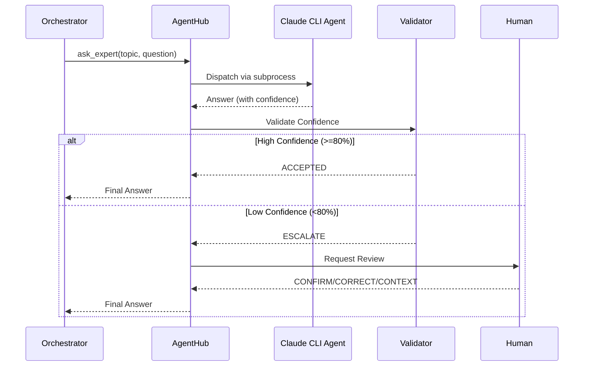

# System Overview

Farmer Code is an AI-orchestrated software development lifecycle (SDLC) automation system. It coordinates AI agents to perform development tasks while maintaining human oversight through approval gates.

## Purpose

Farmer Code automates the mundane aspects of software development while ensuring quality through:

- **Structured Workflow**: 8-phase SDLC with clear deliverables
- **AI Assistance**: Specialist agents for different domains
- **Human Gates**: Approval checkpoints for critical decisions
- **Quality Validation**: Confidence-based answer verification

## High-Level Architecture

```
┌─────────────────────────────────────────────────────────────────────────┐
│                              User Interface                              │
│                        (Future: TUI, Web, CLI)                          │
└─────────────────────────────────────────────────────────────────────────┘
                                    │
                                    ▼
┌─────────────────────────────────────────────────────────────────────────┐
│                          Orchestrator Service                            │
│  ┌─────────────────────────────────────────────────────────────────┐   │
│  │                      State Machine                               │   │
│  │  IDLE → PHASE_1 → PHASE_2 → GATE_1 → DONE                       │   │
│  └─────────────────────────────────────────────────────────────────┘   │
│  ┌─────────────────┐  ┌─────────────────┐  ┌────────────────────┐     │
│  │ Phase Executor  │  │  Label Sync     │  │  Signal Poller     │     │
│  └─────────────────┘  └─────────────────┘  └────────────────────┘     │
└─────────────────────────────────────────────────────────────────────────┘
           │                    │                      │
           ▼                    ▼                      ▼
┌──────────────────┐  ┌──────────────────┐  ┌──────────────────────────┐
│ GitHub           │  │ Worktree         │  │ Agent Hub                │
│ Integration      │  │ Manager          │  │                          │
│                  │  │                  │  │ ┌──────────────────────┐ │
│ - Issues         │  │ - Create/Delete  │  │ │ Question Routing     │ │
│ - Comments       │  │ - Branch Mgmt    │  │ ├──────────────────────┤ │
│ - Labels         │  │ - Plans Setup    │  │ │ Session Management   │ │
│ - PRs            │  │ - Git Operations │  │ ├──────────────────────┤ │
└──────────────────┘  └──────────────────┘  │ │ Answer Validation    │ │
         │                    │              │ ├──────────────────────┤ │
         ▼                    ▼              │ │ Human Escalation     │ │
┌──────────────────┐  ┌──────────────────┐  │ └──────────────────────┘ │
│ GitHub API       │  │ Git Repository   │  └──────────────────────────┘
└──────────────────┘  └──────────────────┘             │
                                                       ▼
                                            ┌──────────────────────┐
                                            │ Claude CLI Agents    │
                                            │ (@duc, @gustave...)  │
                                            └──────────────────────┘
```

## Core Modules

### 1. GitHub Integration (`src/github_integration/`)

Handles all GitHub API interactions:

- **Issues**: Create, update, close feature issues
- **Comments**: Post agent feedback and status updates
- **Labels**: Manage workflow state labels
- **Pull Requests**: Create and link PRs to issues

**Key Classes**: `GitHubService`, `IssueService`, `CommentService`

### 2. Worktree Manager (`src/worktree_manager/`)

Manages git worktrees for isolated feature development:

- **Creation**: New worktree with branch
- **Plans Setup**: Initialize .plans directory structure
- **Git Operations**: Commit, push, branch management
- **Cleanup**: Remove worktree after feature completion

**Key Classes**: `WorktreeService`, `GitClient`

### 3. Orchestrator (`src/orchestrator/`)

Central workflow coordination:

- **State Machine**: Tracks feature progress through phases
- **Phase Execution**: Runs phase 1 and phase 2 operations
- **Agent Dispatch**: Spawns AI agents for tasks
- **Signal Polling**: Monitors for completion signals

**Key Classes**: `OrchestratorService`, `StateMachine`, `PhaseExecutor`

### 4. Agent Hub (`src/agent_hub/`)

Central coordination for agent interactions:

- **Routing**: Direct questions to appropriate expert agents
- **Sessions**: Maintain conversation context across interactions
- **Validation**: Check answer confidence against thresholds
- **Escalation**: Package low-confidence for human review
- **Logging**: Immutable Q&A audit trail

**Key Classes**: `AgentHub`, `AgentRouter`, `SessionManager`, `ConfidenceValidator`, `EscalationHandler`

## Data Flow

### Feature Creation Flow



### Question Routing Flow



## State Management

### Workflow States

| State | Description | Transitions To |
|-------|-------------|----------------|
| `IDLE` | No active work | `PHASE_1` |
| `PHASE_1` | Issue, branch, worktree creation | `PHASE_2` |
| `PHASE_2` | Agent work in progress | `GATE_1` |
| `GATE_1` | Awaiting human approval | `DONE` |
| `DONE` | Feature complete | - |

### State Persistence

State is persisted to JSON files:

```
.plans/{issue_number}/state.json
```

This enables:
- Crash recovery
- Multi-session work
- State inspection for debugging

## External Dependencies

| Dependency | Purpose | Required |
|------------|---------|----------|
| GitHub API | Issue/PR management | Yes |
| Git | Version control | Yes |
| Claude CLI | AI agent execution | Yes |
| File System | State/log persistence | Yes |

## Security Considerations

- **Secrets**: API keys stored in environment variables
- **Validation**: All inputs validated with Pydantic
- **Isolation**: Worktrees prevent cross-feature interference
- **Audit**: Q&A logging provides traceability

## Performance Characteristics

- **State Operations**: Synchronous, file-based (~10ms)
- **GitHub Operations**: Network-bound (~100-500ms)
- **Agent Dispatch**: Variable (5s-120s depending on task)
- **Git Operations**: Local (~50-200ms)

## Services Architecture

> **Status**: Implemented (Feature 008)

The system uses a services-based architecture with independent HTTP services:

```
┌─────────────────┐     ┌─────────────────┐     ┌─────────────────┐
│   Orchestrator  │────▶│   Agent Hub     │────▶│  Agent Services │
│   Service       │     │   Service       │     │ (Baron/Duc/...) │
│   :8000         │     │   :8001         │     │   :8002-8004    │
└─────────────────┘     └─────────────────┘     └─────────────────┘
        │                       │                       │
        ▼                       ▼                       ▼
   ┌─────────┐            ┌─────────┐            ┌─────────┐
   │ SQLite  │            │ SQLite  │            │Claude SDK│
   │Workflows│            │Sessions │            │  Query   │
   └─────────┘            └─────────┘            └─────────┘
```

### Service Ports

| Service | Port | Description |
|---------|------|-------------|
| Orchestrator | 8000 | Workflow state machine |
| Agent Hub | 8001 | Agent routing, sessions |
| Baron | 8002 | PM Agent |
| Duc | 8003 | Architecture Expert |
| Marie | 8004 | Testing Expert |

### Architecture Comparison

| Aspect | Previous (Modules) | Current (Services) |
|--------|-------------------|-------------------|
| Communication | Direct imports | REST APIs |
| State | File-based JSON | SQLite databases |
| Agent Invocation | CLI subprocess | Claude Code SDK |
| Deployment | Single process | Docker Compose |
| Scaling | Vertical | Horizontal |

### Services

- **Orchestrator Service**: Workflow state machine, phase execution
- **Agent Hub Service**: Agent routing, sessions, escalation, audit logging
- **Agent Services**: Stateless SDK-based agents (Baron, Duc, Marie)

For details, see [Services Architecture](../services/README.md).
