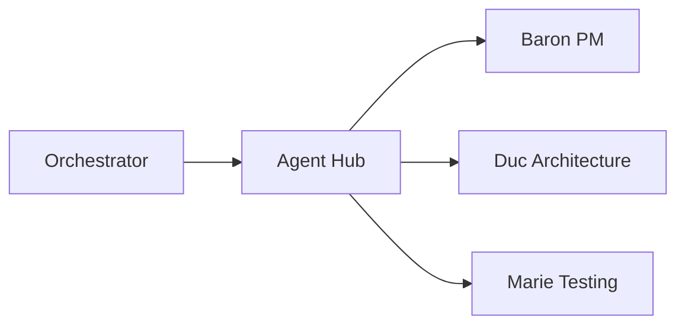

# Farmer Code

AI-powered SDLC automation platform.

## What is Farmer Code?

Farmer Code is a microservices platform that uses AI agents to automate software development lifecycle tasks:

- **Specification Generation** - Generate feature specs from natural language
- **Implementation Planning** - Create detailed implementation plans
- **Task Generation** - Break plans into actionable tasks
- **Expert Consultation** - Ask domain experts (architecture, testing, security)

## Quick Start

```bash
# Clone and install
git clone https://github.com/farmer1st/farmer-code.git
cd farmer-code
uv sync

# Start services
docker-compose up

# Create a workflow
curl -X POST http://localhost:8000/workflows \
  -H "Content-Type: application/json" \
  -d '{"workflow_type": "specify", "feature_description": "Add user authentication"}'
```

**[Full Installation Guide →](getting-started/installation.md)**

## Architecture



| Service | Port | Purpose |
|---------|------|---------|
| Orchestrator | 8000 | Workflow state machine |
| Agent Hub | 8001 | Central coordination |
| Baron | 8002 | PM agent |
| Duc | 8003 | Architecture expert |
| Marie | 8004 | Testing expert |

**[Architecture Overview →](architecture/index.md)**

## Documentation Sections

| Section | Description |
|---------|-------------|
| [Getting Started](getting-started/index.md) | Installation, quickstart, and development setup |
| [Architecture](architecture/index.md) | System design, services, and data flow |
| [Services](services/index.md) | Individual service documentation |
| [Guides](guides/index.md) | How-to guides for common tasks |
| [Reference](reference/index.md) | Configuration, environment variables, API contracts |
| [User Journeys](user-journeys/index.md) | Test scenarios and acceptance criteria |

## Links

- [GitHub Repository](https://github.com/farmer1st/farmer-code)
- [API Reference](reference/api-contracts.md)
- [User Journeys](user-journeys/index.md)
