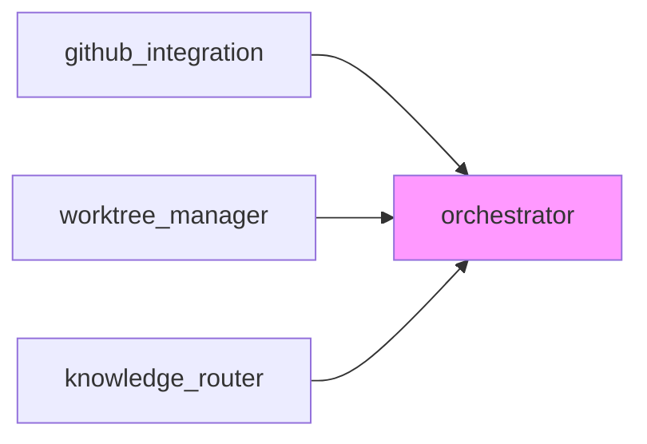

# Module Documentation

Detailed documentation for each Farmer Code module.

## Module Index

| Module | Purpose | Source | Spec |
|--------|---------|--------|------|
| [GitHub Integration](./github-integration.md) | GitHub API operations | [`src/github_integration/`](../../src/github_integration/) | [001](../../specs/001-github-integration-core/) |
| [Worktree Manager](./worktree-manager.md) | Git worktree management | [`src/worktree_manager/`](../../src/worktree_manager/) | [002](../../specs/002-git-worktree-manager/) |
| [Orchestrator](./orchestrator.md) | SDLC workflow state machine | [`src/orchestrator/`](../../src/orchestrator/) | [003](../../specs/003-orchestrator-state-machine/) |
| [Knowledge Router](./knowledge-router.md) | AI agent Q&A routing | [`src/knowledge_router/`](../../src/knowledge_router/) | [004](../../specs/004-knowledge-router/) |

## Module Organization

Each module follows this structure:

```
src/[module]/
├── __init__.py      # Public API exports
├── README.md        # Quick start and API reference
├── models.py        # Pydantic data models
├── service.py       # Main service class
├── exceptions.py    # Module-specific errors
└── ...              # Additional components
```

## Documentation Structure

Each module has two levels of documentation:

1. **Source README** (`src/[module]/README.md`)
   - Quick start guide
   - API reference
   - Usage examples
   - Error handling

2. **Extended Docs** (`docs/modules/[module-name].md`)
   - Architecture details
   - Integration guide
   - Advanced usage
   - Design decisions

## Quick Start

### Using a Module

```python
from [module] import MainService, Request

service = MainService(config)
result = service.operation(Request(...))
```

### Module Dependencies



## Module Status

| Module | Status | Test Coverage | User Journeys |
|--------|--------|---------------|---------------|
| github_integration | Stable | 85% | ORC-001, ORC-002 |
| worktree_manager | Stable | 88% | WT-001 to WT-004 |
| orchestrator | Stable | 84% | ORC-005 |
| knowledge_router | MVP Complete | 84% | KR-001 to KR-004 |

## Adding a New Module

When adding a new module:

1. Create `src/[module]/` with standard structure
2. Add `src/[module]/README.md` with quick start
3. Add `docs/modules/[module-name].md` with extended docs
4. Update this index file
5. Update `docs/architecture/` if needed
