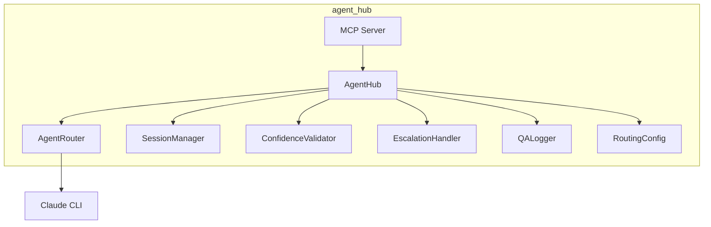
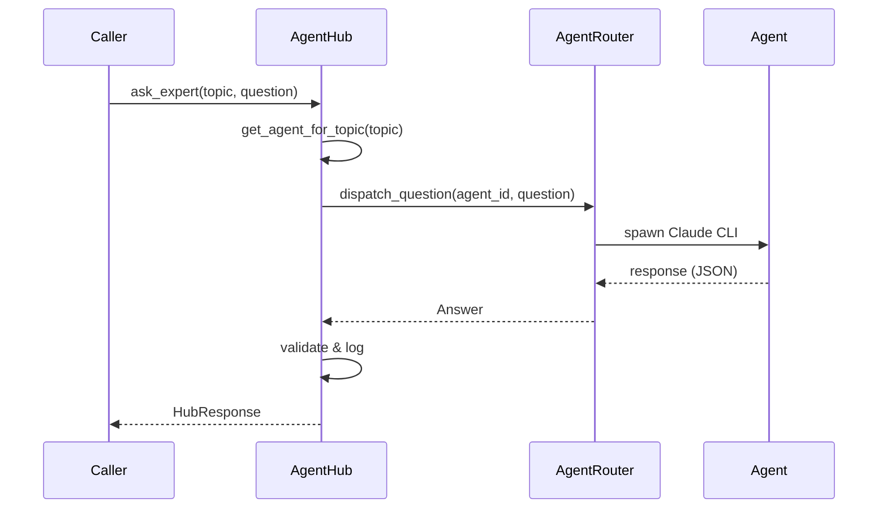
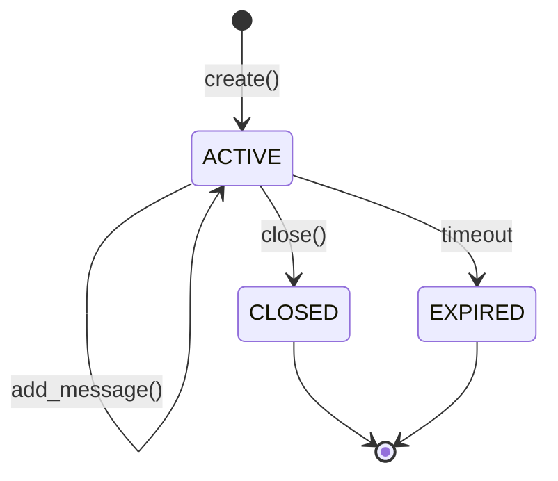
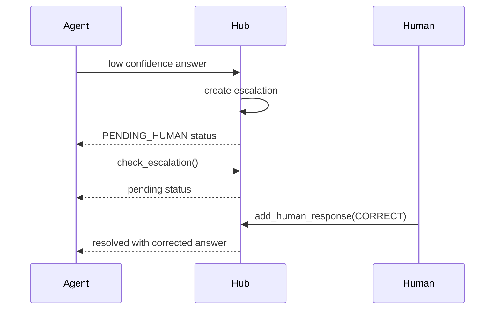

# Agent Hub Module

Central coordination layer for AI agent interactions, session management, and human escalation.

## Overview

The `agent_hub` module provides:

- **Question Routing**: Route questions to specialist AI agents by topic
- **Session Management**: Maintain conversation context across interactions
- **Answer Validation**: Validate confidence against thresholds
- **Human Escalation**: Package low-confidence answers for review
- **Audit Logging**: Immutable audit trail for retrospectives
- **MCP Server**: Expose tools via Model Context Protocol

## Quick Start

```python
from agent_hub import AgentHub, ConfigLoader

# Initialize hub from config
config = ConfigLoader.load_from_file("config/routing.yaml")
hub = AgentHub(config, log_dir="logs/qa")

# Ask an expert
response = hub.ask_expert(
    topic="architecture",
    question="Which auth method should we use for the API?",
    context="Building microservices with 10K concurrent users",
    feature_id="005-user-auth",
)

if response.status.value == "resolved":
    print(f"Answer: {response.answer}")
    print(f"Confidence: {response.confidence}%")
else:
    print(f"Pending human review: {response.escalation_id}")
```

## Source Documentation

For API reference and detailed usage, see:
- [`src/agent_hub/README.md`](../../src/agent_hub/README.md)

## Architecture



## Question Routing

### Routing Flow



### Agent Mapping

| Topic | Agent | Model |
|-------|-------|-------|
| architecture | @duc | opus |
| devops | @gustave | sonnet |
| security | @charles | opus |
| frontend | @dali | sonnet |
| backend | @dede | sonnet |
| testing | @marie | sonnet |

## Session Management

### Session Lifecycle



### Multi-Turn Conversations

```python
# First question creates a session
response1 = hub.ask_expert(topic="architecture", question="Q1?")

# Follow-up preserves context
response2 = hub.ask_expert(
    topic="architecture",
    question="What about Q2?",
    session_id=response1.session_id,
)

# Get conversation history
session = hub.get_session(response1.session_id)
for msg in session.messages:
    print(f"{msg.role}: {msg.content}")
```

## Answer Validation

### Confidence Thresholds

| Threshold Type | Value | Source |
|----------------|-------|--------|
| Default | 80% | config |
| Topic Override | varies | config |

### Validation Outcomes

| Outcome | Condition | Action |
|---------|-----------|--------|
| `RESOLVED` | confidence >= threshold | Return answer |
| `PENDING_HUMAN` | confidence < threshold | Human review |

## Human Escalation

### Response Actions

| Action | Description | Result |
|--------|-------------|--------|
| `CONFIRM` | Accept tentative answer | Original answer returned |
| `CORRECT` | Replace with human answer | 100% confidence answer |
| `ADD_CONTEXT` | Provide more context | Re-route to agent |

### Escalation Flow



## MCP Server

### Running as MCP Server

```bash
python -m agent_hub.mcp_server
```

### Available Tools

| Tool | Description | Parameters |
|------|-------------|------------|
| `ask_expert` | Route question to expert | topic, question, context, session_id |
| `check_escalation` | Check escalation status | escalation_id |

### Claude Agent SDK Integration

```python
from claude_code_sdk import query, ClaudeCodeOptions

async for event in query(
    prompt="Ask the architecture expert about caching",
    options=ClaudeCodeOptions(
        mcp_servers={
            "agent-hub": {
                "command": "python",
                "args": ["-m", "agent_hub.mcp_server"]
            }
        }
    )
):
    ...
```

## Audit Logging

### Log Structure

Logs are stored in JSONL format:

```
logs/qa/{feature_id}.jsonl
```

Each line is a complete `QALogEntry`:

```json
{
  "id": "uuid",
  "feature_id": "005-user-auth",
  "question": {...},
  "answer": {...},
  "validation_result": {...},
  "escalation": null,
  "final_answer": {...},
  "routing_decision": "Routed to architect (@duc) based on topic 'architecture'",
  "session_id": "uuid",
  "total_duration_seconds": 3.5
}
```

### Retrieving Logs

```python
logs = hub.get_logs_for_feature("005-user-auth")
for log in logs:
    print(f"Q: {log['question']['question']}")
    print(f"Session: {log['session_id']}")
```

## Configuration

### Routing Configuration

```yaml
# config/routing.yaml
defaults:
  confidence_threshold: 80
  timeout_seconds: 120
  model: sonnet

agents:
  architect:
    name: "@duc"
    model: opus
    topics: [architecture, design, patterns]

overrides:
  security:
    agent: architect
    confidence_threshold: 95
```

## Error Handling

```python
from agent_hub import (
    UnknownTopicError,
    SessionNotFoundError,
    EscalationError,
)

try:
    response = hub.ask_expert(topic="unknown", question="Test?")
except UnknownTopicError as e:
    print(f"Unknown topic: {e.topic}")
    print(f"Available: {e.available_topics}")
```

## User Journeys

| Journey | Description | Status |
|---------|-------------|--------|
| [AH-001](../user-journeys/AH-001-route-question.md) | Route Question to Expert | Implemented |
| [AH-002](../user-journeys/AH-002-session-management.md) | Maintain Conversation Sessions | Implemented |
| [AH-003](../user-journeys/AH-003-confidence-escalation.md) | Validate Confidence and Escalate | Implemented |
| [AH-004](../user-journeys/AH-004-pending-escalation.md) | Track Pending Escalations | Implemented |
| [AH-005](../user-journeys/AH-005-audit-logging.md) | Audit Trail Logging | Implemented |

## Related Documentation

- [Specification](../../specs/005-agent-hub-refactor/spec.md)
- [Contracts](../../specs/005-agent-hub-refactor/contracts/)
- [Architecture](../architecture/agent-hub.md)
