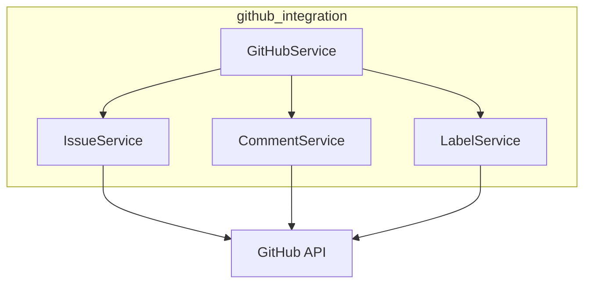

# GitHub Integration Module

Wrapper around the GitHub API for issue, comment, label, and PR management.

## Overview

The `github_integration` module provides a clean interface for GitHub operations:

- **Issues**: Create, update, close, query issues
- **Comments**: Add comments to issues and PRs
- **Labels**: Manage issue labels for workflow state
- **Pull Requests**: Create and link PRs to issues

## Quick Start

```python
from github_integration import GitHubService

# Initialize from environment
service = GitHubService.from_env()

# Create an issue
issue = service.issues.create(
    title="Feature: Add authentication",
    body="Implement OAuth2 authentication flow.",
    labels=["enhancement", "status:new"]
)

print(f"Created issue #{issue.number}")

# Add a comment
service.issues.add_comment(
    issue_number=issue.number,
    body="Starting architecture review."
)

# Update labels
service.issues.update_labels(
    issue_number=issue.number,
    labels=["status:phase-1"]
)
```

## Source Documentation

For API reference and detailed usage, see:
- [`src/github_integration/README.md`](../../src/github_integration/README.md)

## Architecture



## Configuration

### Environment Variables

| Variable | Description | Required |
|----------|-------------|----------|
| `GITHUB_TOKEN` | Personal access token or GitHub App token | Yes |
| `GITHUB_REPO` | Repository in `owner/repo` format | Yes |

### Token Permissions

Required GitHub token permissions:
- `repo` - Full control of repositories
- `workflow` - Workflow management (if using GitHub Actions)

## Integration Points

### Used By

- **Orchestrator**: Issue creation, label sync, comment posting
- **Knowledge Router**: Escalation comment posting (optional)

### Dependencies

- `PyGithub` - GitHub API client
- `python-dotenv` - Environment loading

## Error Handling

```python
from github_integration import GitHubAPIError, IssueNotFoundError

try:
    issue = service.issues.get(999999)
except IssueNotFoundError:
    print("Issue does not exist")
except GitHubAPIError as e:
    print(f"GitHub API error: {e}")
```

## User Journeys

| Journey | Description |
|---------|-------------|
| [ORC-001](../user-journeys/ORC-001-create-issue.md) | Create Issue for New Feature |
| [ORC-002](../user-journeys/ORC-002-agent-feedback.md) | Agent Provides Feedback |

## Related Documentation

- [Specification](../../specs/001-github-integration-core/spec.md)
- [Contracts](../../specs/001-github-integration-core/contracts/)
- [API Documentation](../api/README.md)
