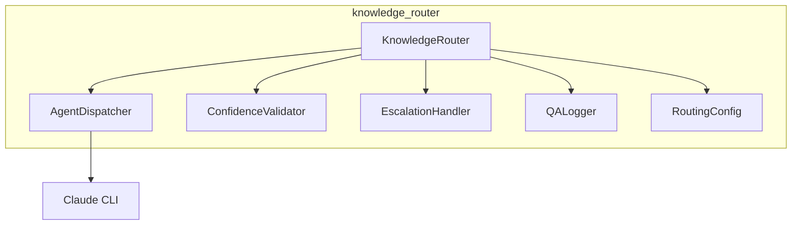
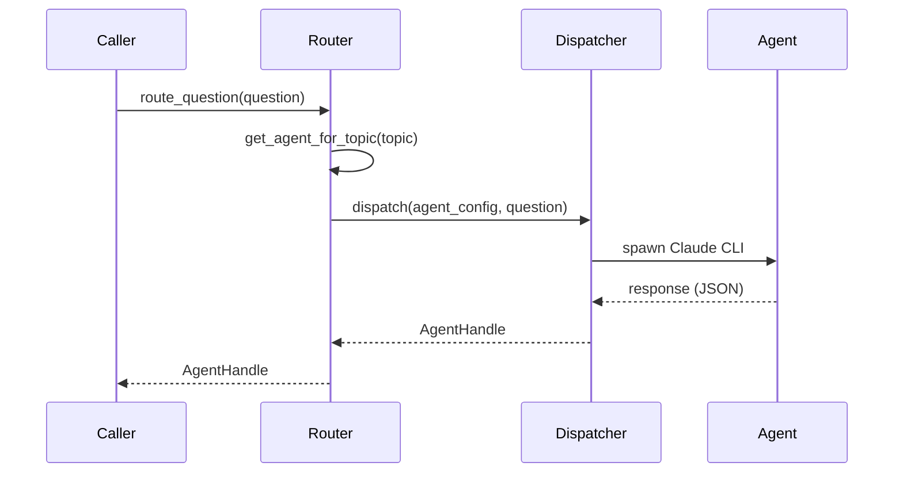

# Knowledge Router Module

AI agent Q&A routing, validation, and escalation system.

## Overview

The `knowledge_router` module provides:

- **Question Routing**: Route questions to specialist AI agents
- **Answer Validation**: Validate confidence against thresholds
- **Human Escalation**: Package low-confidence answers for review
- **Q&A Logging**: Immutable audit trail for retrospectives

## Quick Start

```python
from pathlib import Path
from knowledge_router import (
    KnowledgeRouter,
    Question,
    QuestionTarget,
    HumanAction,
    HumanResponse,
)

# Initialize router
router = KnowledgeRouter(Path("config/routing.yaml"))

# Create a question
question = Question(
    id="q-001",
    topic="authentication",
    suggested_target=QuestionTarget.ARCHITECT,
    question="Which auth method should we use for the API?",
    feature_id="005-user-auth",
)

# Route to agent
handle = router.route_question(question)
print(f"Routed to {handle.agent_name}")

# Submit answer for validation
answer = router.submit_answer(handle, question)
print(f"Confidence: {answer.confidence}%")

if answer.is_high_confidence:
    print(f"Accepted: {answer.answer}")
else:
    # Escalate to human
    validation = router.validate_answer(answer)
    escalation = router.escalate_to_human(question, validation)

    # Human responds (in practice, this comes from UI/GitHub)
    response = HumanResponse(
        escalation_id=escalation.id,
        responder="reviewer",
        action=HumanAction.CONFIRM,
    )

    result = router.handle_human_response(escalation, response)
    print(f"Final answer: {result.final_answer.answer}")
```

## Source Documentation

For API reference and detailed usage, see:
- [`src/knowledge_router/README.md`](../../src/knowledge_router/README.md)

## Architecture



## Question Routing

### Routing Flow



### Agent Mapping

| Topic | Agent | Model |
|-------|-------|-------|
| architecture | @duc | opus |
| devops | @gustave | sonnet |
| security | @charles | opus |
| frontend | @dali | sonnet |
| backend | @dede | sonnet |
| testing | @marie | sonnet |

## Answer Validation

### Confidence Thresholds

| Threshold Type | Value | Source |
|----------------|-------|--------|
| Default | 80% | config |
| Topic Override | varies | config |

### Validation Outcomes

| Outcome | Condition | Action |
|---------|-----------|--------|
| `ACCEPTED` | confidence >= threshold | Return answer |
| `ESCALATE` | confidence < threshold | Human review |

## Human Escalation

### Response Actions

| Action | Description | Result |
|--------|-------------|--------|
| `CONFIRM` | Accept tentative answer | Original answer returned |
| `CORRECT` | Replace with human answer | 100% confidence answer |
| `ADD_CONTEXT` | Provide more context | Re-route to agent |

### Escalation Format

When escalated, a GitHub comment is generated:

```markdown
## :warning: Low Confidence Answer - Human Review Required

**Topic:** `security`
**Confidence:** 65% (threshold: 80%)

### Question
What encryption algorithm should we use?

### Tentative Answer
Use AES-256 for encryption.

### Actions
- `/confirm` - Accept this answer
- `/correct <answer>` - Provide correct answer
- `/context <info>` - Add context and retry
```

## Q&A Logging

### Log Structure

Logs are stored in JSONL format:

```
logs/qa/{feature_id}.jsonl
```

Each line is a complete `QALogEntry`:

```json
{
  "id": "uuid",
  "feature_id": "005-user-auth",
  "question": {...},
  "answer": {...},
  "validation_result": {...},
  "escalation": null,
  "final_answer": {...},
  "total_duration_seconds": 3.5
}
```

### Retrieving Logs

```python
from knowledge_router import QALogger

logger = QALogger(Path("logs/qa"))
logs = logger.get_logs_for_feature("005-user-auth")
```

## Configuration

### Routing Configuration

```yaml
# config/routing.yaml
default_threshold: 80

agents:
  - target: architect
    name: "@duc"
    model: opus
    topics: [architecture, design, patterns]

topic_overrides:
  security:
    threshold: 95
```

## Error Handling

```python
from knowledge_router import (
    RoutingError,
    AgentDispatchError,
    AgentTimeoutError,
)

try:
    handle = router.route_question(question)
except RoutingError:
    print("No agent available for topic")
except AgentDispatchError as e:
    print(f"Agent failed to start: {e}")
except AgentTimeoutError:
    print("Agent timed out")
```

## User Journeys

| Journey | Description | Status |
|---------|-------------|--------|
| [KR-001](../user-journeys/KR-001-route-question.md) | Route Question to Agent | Implemented |
| [KR-002](../user-journeys/KR-002-validate-confidence.md) | Validate Answer Confidence | Implemented |
| [KR-003](../user-journeys/KR-003-escalate-human.md) | Escalate to Human | Implemented |
| [KR-004](../user-journeys/KR-004-log-qa.md) | Log Q&A Exchange | Implemented |
| KR-005 | Dispatch Execution Tasks | Planned (P2) |
| KR-006 | Configure Routing Rules | Planned (P2) |
| KR-007 | Generate Retrospective | Planned (P2) |
| KR-008 | Handle Unavailability | Planned (P3) |

## Related Documentation

- [Specification](../../specs/004-knowledge-router/spec.md)
- [Contracts](../../specs/004-knowledge-router/contracts/)
- [Architecture](../architecture/system-overview.md)
