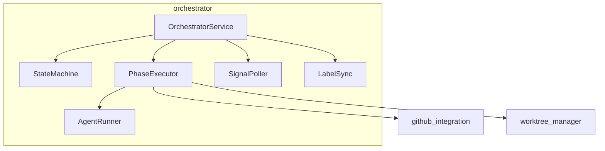
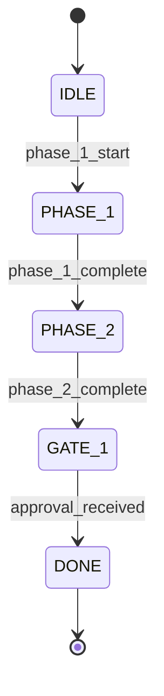

# Orchestrator Module

SDLC workflow state machine for automated development lifecycle management.

## Overview

The `orchestrator` module provides:

- **State Machine**: Track feature progress through workflow phases
- **Phase Execution**: Execute Phase 1 and Phase 2 operations
- **Agent Dispatch**: Spawn AI agents for development tasks
- **Signal Polling**: Monitor for completion signals
- **Label Sync**: Keep GitHub labels in sync with workflow state

## Quick Start

```python
from pathlib import Path
from github_integration import GitHubService
from worktree_manager import WorktreeService
from orchestrator import OrchestratorService, Phase1Request

# Initialize dependencies
github = GitHubService.from_env()
worktree = WorktreeService(Path("."))

# Create orchestrator
orchestrator = OrchestratorService(
    repo_path=Path("."),
    github_service=github,
    worktree_service=worktree
)

# Execute Phase 1 (issue, branch, worktree, plans)
result = orchestrator.execute_phase_1(
    Phase1Request(
        feature_description="Add OAuth2 authentication",
        labels=["enhancement"]
    )
)

if result.success:
    print(f"Created issue #{result.issue_number}")
    print(f"Worktree at {result.worktree_path}")

# Check workflow state
state = orchestrator.get_state(result.issue_number)
print(f"Current state: {state.current_state}")

# Poll for completion signals
poll_result = orchestrator.poll_for_signal(
    issue_number=result.issue_number,
    signal_type="agent_complete",
    timeout=300
)
```

## Source Documentation

For API reference and detailed usage, see:
- [`src/orchestrator/README.md`](../../src/orchestrator/README.md)

## Architecture



## State Machine

### States

| State | Description |
|-------|-------------|
| `IDLE` | No active work on this feature |
| `PHASE_1` | Creating issue, branch, worktree |
| `PHASE_2` | Agent work in progress |
| `GATE_1` | Awaiting human approval |
| `DONE` | Feature complete |

### Transitions



## State Persistence

Workflow state is persisted to:

```
.plans/{issue_number}/state.json
```

Example:
```json
{
  "issue_number": 123,
  "current_state": "phase_2",
  "feature_name": "oauth2-auth",
  "branch_name": "123-oauth2-auth",
  "worktree_path": "/worktrees/123-oauth2-auth",
  "created_at": "2026-01-04T10:00:00Z",
  "updated_at": "2026-01-04T10:30:00Z"
}
```

## Label Mapping

| State | GitHub Label |
|-------|--------------|
| `IDLE` | `status:new` |
| `PHASE_1` | `status:phase-1` |
| `PHASE_2` | `status:phase-2` |
| `GATE_1` | `status:awaiting-approval` |
| `DONE` | `status:done` |

## Configuration

No specific configuration required. Uses:
- GitHub credentials from environment
- Git configuration from local repo

## Integration Points

### Depends On

- **github_integration**: Issue/label operations
- **worktree_manager**: Worktree creation and management

### Dependencies

- `pydantic` - Data validation
- `subprocess` - Agent execution

## Error Handling

```python
from orchestrator import (
    InvalidStateTransition,
    PhaseExecutionError,
    PollTimeoutError
)

try:
    result = orchestrator.execute_phase_1(request)
except InvalidStateTransition as e:
    print(f"Cannot transition: {e}")
except PhaseExecutionError as e:
    print(f"Phase failed: {e}")
```

## User Journeys

| Journey | Description |
|---------|-------------|
| [ORC-001](../user-journeys/ORC-001-create-issue.md) | Create Issue for New Feature |
| [ORC-005](../user-journeys/ORC-005-full-sdlc-workflow.md) | Complete 8-Phase SDLC Workflow |

## Related Documentation

- [Specification](../../specs/003-orchestrator-state-machine/spec.md)
- [Contracts](../../specs/003-orchestrator-state-machine/contracts/)
- [Architecture](../architecture/system-overview.md)
