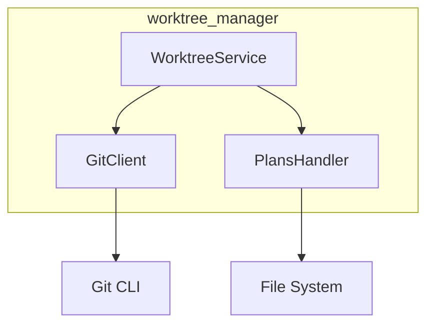

# Worktree Manager Module

Git worktree management for isolated feature development.

## Overview

The `worktree_manager` module provides:

- **Worktree Creation**: Create isolated worktrees with branches
- **Plans Initialization**: Set up .plans directory structure
- **Git Operations**: Commit, push, branch management
- **Cleanup**: Remove worktrees after feature completion

## Quick Start

```python
from pathlib import Path
from worktree_manager import WorktreeService, CreateWorktreeRequest

# Initialize service
service = WorktreeService(Path("/path/to/repo"))

# Create a worktree for a feature
result = service.create_worktree(
    CreateWorktreeRequest(
        branch_name="123-add-auth",
        worktree_path=Path("/worktrees/123-add-auth")
    )
)

if result.success:
    print(f"Created worktree at {result.worktree_path}")

# Initialize plans directory
service.init_plans(result.worktree_path)

# Commit and push changes
service.commit_and_push(
    CommitRequest(
        worktree_path=result.worktree_path,
        message="feat: add authentication",
        push=True
    )
)

# Cleanup when done
service.delete_worktree(result.worktree_path)
```

## Source Documentation

For API reference and detailed usage, see:
- [`src/worktree_manager/README.md`](../../src/worktree_manager/README.md)

## Architecture



## Worktree Structure

When a worktree is created:

```
/worktrees/123-add-auth/
├── .git/                    # Git worktree link
├── src/                     # Source code
├── tests/                   # Tests
└── .plans/                  # Initialized by init_plans()
    ├── spec.md
    ├── plan.md
    └── tasks.md
```

## Configuration

No configuration required. The service uses the local git configuration.

## Integration Points

### Used By

- **Orchestrator**: Creates worktrees for Phase 1, manages commits

### Dependencies

- `subprocess` - Git command execution
- `pathlib` - Path handling

## Error Handling

```python
from worktree_manager import (
    BranchExistsError,
    WorktreeExistsError,
    GitCommandError
)

try:
    result = service.create_worktree(request)
except BranchExistsError:
    print("Branch already exists")
except WorktreeExistsError:
    print("Worktree path already in use")
except GitCommandError as e:
    print(f"Git command failed: {e}")
```

## User Journeys

| Journey | Description |
|---------|-------------|
| [WT-001](../user-journeys/WT-001-create-worktree.md) | Create Worktree for Feature |
| [WT-002](../user-journeys/WT-002-init-plans.md) | Initialize Plans Folder |
| [WT-003](../user-journeys/WT-003-commit-push.md) | Commit and Push Changes |
| [WT-004](../user-journeys/WT-004-cleanup-worktree.md) | Cleanup Worktree |

## Related Documentation

- [Specification](../../specs/002-git-worktree-manager/spec.md)
- [Contracts](../../specs/002-git-worktree-manager/contracts/)
