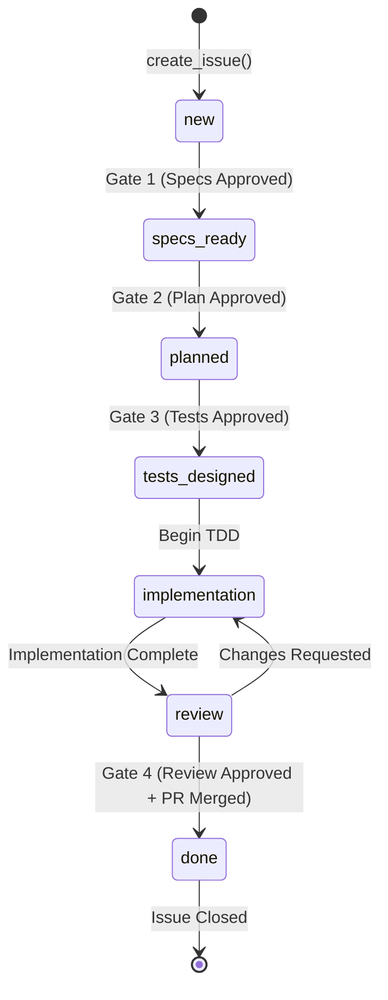

# ORC-003: Progress Issue Through Workflow Phases

**Actor**: Orchestrator System + AI Agents
**Goal**: Transition issue through 8 workflow phases using labels to track state
**Preconditions**:
- Issue exists (created via ORC-001)
- Labels configured in repository:
  - `status:new`
  - `status:specs-ready`
  - `status:planned`
  - `status:tests-designed`
  - `status:implementation`
  - `status:review`
  - `status:done`

**Priority**: P2 (Important for workflow visibility)
**Status**: 📋 Planned (not yet implemented)

## Steps

### 1. Initialize with Status Label
- **Action**: Add `status:new` label when issue is created
- **Expected outcome**: Issue has initial workflow state
- **System behavior**: `create_issue()` includes `labels=["status:new"]`

### 2. Progress to Specs Ready (Gate 1)
- **Action**: Architect approves specs → update label
- **Expected outcome**: Label changes from `status:new` to `status:specs-ready`
- **System behavior**:
  - Call `update_issue(issue_number, labels=["status:specs-ready"])`
  - Removes old status label
  - Adds new status label
  - Triggers notification to planning agents

### 3. Progress Through Remaining Phases
- **Action**: Each gate approval advances workflow
- **Expected outcome**: Labels update according to state machine:
  ```
  status:new → status:specs-ready → status:planned →
  status:tests-designed → status:implementation →
  status:review → status:done
  ```
- **System behavior**: Each transition updates GitHub issue labels

### 4. Query Issues by Workflow State
- **Action**: Filter issues by status label
- **Expected outcome**: Can view all issues in specific workflow phase
- **System behavior**:
  - `list_issues(labels=["status:implementation"])` returns all issues currently being implemented
  - Enables workflow dashboard/kanban view

### 5. Track Label History
- **Action**: View issue label change events
- **Expected outcome**: Complete audit trail of workflow progression
- **System behavior**: GitHub tracks label change events (visible in issue timeline)

## Success Criteria

✅ **State Transitions**: Labels update correctly at each phase
✅ **Single Status**: Issue has exactly one `status:*` label at any time
✅ **Queryable**: Can filter issues by workflow phase
✅ **Audit Trail**: Label change history visible in GitHub
✅ **Validation**: Cannot skip phases (enforced by orchestrator)
✅ **Rollback**: Can move backward if issues found (e.g., review → implementation)

## Label Management

### Status Labels (Mutually Exclusive)

Only one `status:*` label active at a time:

| Label | Phase | Meaning | Assigned To |
|-------|-------|---------|-------------|
| `status:new` | 1 | Issue created, awaiting specs | @duc (architect) |
| `status:specs-ready` | 2 | Specs approved (Gate 1) | @dede/@dali (implementers) |
| `status:planned` | 3 | Implementation plan ready (Gate 2) | @marie (test designer) |
| `status:tests-designed` | 4 | Tests designed (Gate 3) | @dede/@dali (implementers) |
| `status:implementation` | 5 | Tests + code being written | Implementers |
| `status:review` | 6 | Code review in progress | @dede (reviewer) + human |
| `status:done` | 7-8 | PR merged, feature deployed | (closed) |

### Additional Labels (Non-Status)

Can coexist with status labels:
- `priority:p1`, `priority:p2`, `priority:p3`
- `type:feature`, `type:bug`, `type:refactor`
- `domain:backend`, `domain:frontend`, `domain:infra`
- `test:automated` (for test cleanup)

## E2E Test Coverage

- **Test file**: `tests/e2e/test_workflow_labels.py` (future)
- **Journey marker**: `@pytest.mark.journey("ORC-003")`
- **Test method**: Not yet implemented
- **Covered steps**: 0/5 (0% coverage)
- **Test status**: ⏳ Not implemented

## Implementation Status

**User Story 3** from `specs/001-github-integration-core/spec.md`:
- Create Label: `create_label(name, color, description)` → Not implemented
- Get Label: `get_label(name)` → Not implemented
- List Labels: `list_labels()` → Not implemented
- Add Label to Issue: `add_label(issue_number, label)` → Not implemented (use update_issue)
- Remove Label from Issue: `remove_label(issue_number, label)` → Not implemented (use update_issue)
- Update Issue Labels: `update_issue(issue_number, labels=[...])` → ✅ Implemented

## Workflow State Machine



## Related Journeys

- **ORC-001**: Create Issue (sets initial `status:new` label)
- **ORC-002**: Agent Provides Feedback (comments trigger label changes)
- **ORC-004**: Link Pull Request (PR merge triggers `status:done`)
- **ORC-005**: Complete SDLC Workflow (labels track progress through all 8 phases)

## Implementation References

- **Spec**: `specs/001-github-integration-core/spec.md` (User Story 3)
- **Contract**: `specs/001-github-integration-core/contracts/github_service.md` (future)
- **Model**: `src/github_integration/models.py::Label` (exists)
- **Service**: `src/github_integration/service.py::update_issue()` (implemented)

## Notes

- Label color coding helps visual distinction:
  - `status:new`: Gray (#EDEDED)
  - `status:specs-ready`: Blue (#0075CA)
  - `status:planned`: Green (#0E8A16)
  - `status:implementation`: Yellow (#FFA500)
  - `status:review`: Orange (#FF6347)
  - `status:done`: Purple (#8B5CF6)

- Label transitions enforce workflow discipline
- Enables dashboard views (Kanban board by label)
- Critical for ORC-005 (full SDLC workflow) visibility
