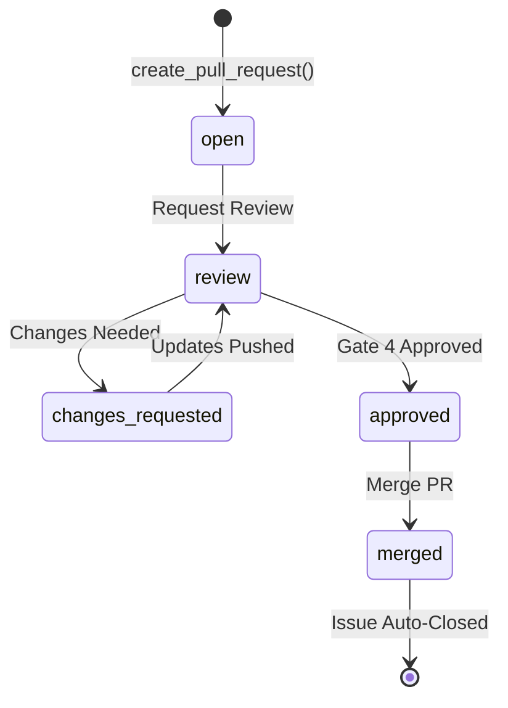

# ORC-004: Link Pull Request to Feature Issue

**Actor**: Implementation Agent + Human Reviewer
**Goal**: Create pull request that links to feature issue for automatic closure on merge
**Preconditions**:
- Issue exists and is in `status:review` state
- Implementation complete (all tests passing)
- Feature branch created
- Changes committed to branch

**Priority**: P3 (Important but lower priority than core workflow)
**Status**: 📋 Planned (not yet implemented)

## Steps

### 1. Create Pull Request
- **Action**: Call `create_pull_request(title, body, base, head, linked_issues)`
- **Expected outcome**: PR created on GitHub
- **System behavior**:
  - Makes POST /repos/{owner}/{repo}/pulls API call
  - PR body includes `Closes #<issue_number>` keyword
  - Returns `PullRequest` model with PR number

### 2. Link to Feature Issue
- **Action**: PR body contains `Closes #123` or similar keyword
- **Expected outcome**: GitHub recognizes issue linkage
- **System behavior**:
  - GitHub parses PR body for issue keywords
  - Creates link visible in PR and issue UI
  - Sets up auto-close trigger

### 3. Verify PR Metadata
- **Action**: Retrieve PR details with `get_pull_request(pr_number)`
- **Expected outcome**: PR has correct:
  - Title matching feature
  - Base branch (typically `main`)
  - Head branch (feature branch)
  - Linked issues list
- **System behavior**:
  - Makes GET /repos/{owner}/{repo}/pulls/{pr_number}
  - Parses `body` for linked issues
  - Returns `PullRequest` model

### 4. List Feature PRs
- **Action**: Query PRs for specific feature
- **Expected outcome**: Can find all PRs related to issue
- **System behavior**:
  - `list_pull_requests(linked_issues=[123])` returns matching PRs
  - Enables tracking multiple PRs per feature

### 5. Merge PR and Close Issue
- **Action**: Human approves Gate 4 → PR merged
- **Expected outcome**:
  - PR merged to base branch
  - Linked issue automatically closed
  - Issue label updated to `status:done`
- **System behavior**:
  - GitHub auto-closes linked issues on PR merge
  - Orchestrator can detect merge via webhooks (future) or polling

## Success Criteria

✅ **PR Created**: Pull request visible on GitHub
✅ **Issue Linked**: PR shows "Closes #123" reference
✅ **Metadata Correct**: Title, branches, linked issues all accurate
✅ **Auto-Close**: Issue closes automatically when PR merges
✅ **Traceability**: Can navigate from issue → PR → commits
✅ **Audit Trail**: Complete history from issue creation to PR merge

## E2E Test Coverage

- **Test file**: `tests/e2e/test_pull_requests.py` (future)
- **Journey marker**: `@pytest.mark.journey("ORC-004")`
- **Test method**: Not yet implemented
- **Covered steps**: 0/5 (0% coverage)
- **Test status**: ⏳ Not implemented

## Implementation Status

**User Story 4** from `specs/001-github-integration-core/spec.md`:
- Create PR: `create_pull_request(title, body, base, head, linked_issues)` → Not implemented
- Get PR: `get_pull_request(pr_number)` → Not implemented
- List PRs: `list_pull_requests(state, linked_issues)` → Not implemented
- PR Model: `PullRequest` with `is_linked_to(issue_number)` → Model exists, method not implemented

## PR Body Format

```markdown
# [Feature Name]

## Summary
- Implemented feature X
- Added Y functionality
- Fixed Z issue

## Changes
- `src/module/file.py`: Added feature implementation
- `tests/test_file.py`: Added comprehensive tests
- `docs/README.md`: Updated documentation

## Test Results
- ✅ 48/48 tests passing
- ✅ 88% code coverage
- ✅ All contract tests passing
- ✅ E2E tests passing

## Checklist
- [x] Tests written and passing
- [x] Documentation updated
- [x] Constitution compliance verified
- [x] No security vulnerabilities
- [x] Code reviewed

Closes #123

🤖 Generated with [Claude Code](https://claude.com/claude-code)

Co-Authored-By: Claude Opus 4.5 <noreply@anthropic.com>
```

## Linking Keywords

GitHub recognizes these keywords for auto-closing issues:
- `Closes #123`
- `Fixes #123`
- `Resolves #123`
- `Closes: #123`
- `Fixes: #123`
- `Resolves: #123`

Multiple issues: `Closes #123, #124, #125`

## PR States and Workflow



## Related Journeys

- **ORC-001**: Create Issue (issue must exist before PR)
- **ORC-003**: Progress Issue Through Workflow Phases (PR merge triggers `status:done`)
- **ORC-005**: Complete SDLC Workflow (PR is Phase 6-7)

## Implementation References

- **Spec**: `specs/001-github-integration-core/spec.md` (User Story 4)
- **Contract**: `specs/001-github-integration-core/contracts/github_service.md` (future)
- **Model**: `src/github_integration/models.py::PullRequest` (exists)
- **Service**: `src/github_integration/service.py::create_pull_request()` (future)

## Notes

- PRs enable code review before merge (Gate 4)
- Auto-close on merge prevents manual issue cleanup
- One issue can have multiple PRs (e.g., backend + frontend)
- PR templates can enforce checklist completion
- Draft PRs allow WIP sharing without triggering reviews
- This journey is critical for Phase 6-7 of ORC-005 (full SDLC workflow)
