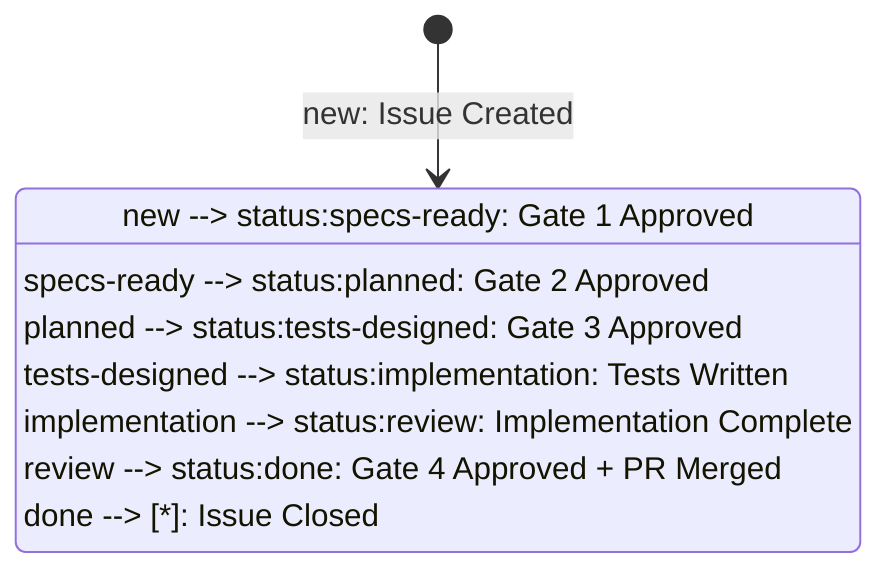

# ORC-005: Complete 8-Phase SDLC Workflow

**Actor**: Development Team (Product Owner + AI Agents)
**Goal**: Complete a full feature development cycle from idea to deployment using AI agent orchestration
**Preconditions**:
- GitHub App configured and installed
- Farmer Code orchestrator running
- Repository cloned with worktrees configured
- AI agents (@duc, @dede, @marie, etc.) available

**Priority**: P1 (Core value proposition of Farmer Code)

## Overview

This journey represents the complete end-to-end SDLC workflow managed by the Farmer Code orchestrator. It encompasses all 8 phases from feature request to deployment.

## 8-Phase SDLC Workflow

### Phase 1: Issue & Worktree Creation
- **Actor**: Product Owner / Dev Lead
- **Action**: Create GitHub issue for new feature
- **Journey**: **ORC-001** (Create Issue for New Feature Request)
- **Labels**: `status:new`
- **Assignee**: `@duc` (architect)
- **Output**: GitHub issue with unique number, Git worktree created

### Phase 2: Architecture & Specs
- **Actor**: Architecture Agent (`@duc`)
- **Action**: Design system architecture and create specifications
- **Journey**: *(Covered in ORC-001 for basic tracking)*
- **Labels**: `status:new` → `status:specs-ready`
- **Artifacts**:
  - `spec.md`: Feature specification with user stories
  - `plan.md`: Implementation plan
  - `data-model.md`: Data structures
  - `contracts/`: API contracts
- **Gate 1**: Human approval of architecture and specs

### Phase 3: Implementation Plans
- **Actor**: Implementation Agents (`@dede`, `@dali`, `@gus`)
- **Action**: Create detailed execution plans (Journey: ORC-002 - Agent Feedback)
- **Labels**: `status:specs-ready` → `status:planned`
- **Artifacts**: `tasks.md` with dependency-ordered tasks
- **Gate 2**: Human approval of implementation plans

### Phase 4: Test Design
- **Actor**: Test Agent (`@marie`)
- **Action**: Design comprehensive test suite
- **Labels**: `status:planned` → `status:tests-designed`
- **Artifacts**: Test cases in `tests/` directories
- **Gate 3**: Human approval of test design

### Phase 5: Implementation (TDD)
- **Actor**: Implementation Agents
- **Action**: Write tests first (RED), then implementation (GREEN), then refactor
- **Journey**: (Current feature implements create_issue, get_issue, list_issues, update_issue, close_issue)
- **Labels**: `status:tests-designed` → `status:implementation`
- **Output**: All tests passing, code coverage ≥80%

### Phase 6: Code Review
- **Actor**: Review Agent (`@dede`) + Human Reviewer
- **Action**: Review code against specs and constitution
- **Journey**: ORC-004 (Link Pull Request) - Create PR linking to issue
- **Labels**: `status:implementation` → `status:review`
- **Gate 4**: Human approval of code review

### Phase 7: Merge & Deploy
- **Actor**: Human + CI/CD
- **Action**: Merge PR to main branch, deploy to environment
- **Labels**: `status:review` → `status:done`
- **Output**: Feature deployed, issue closed

### Phase 8: Verification
- **Actor**: Test Agent + Product Owner
- **Action**: Verify feature works in production environment
- **Labels**: `status:done` (remains)
- **Output**: Feature verified, issue remains closed

## Current Implementation Status

| Phase | Status | Journey ID | Test Coverage |
|-------|--------|------------|---------------|
| 1. Issue & Worktree Creation | ✅ Implemented | ORC-001 | ✅ 100% |
| 2. Architecture & Specs | ✅ Implemented | (ORC-001) | ✅ 100% |
| 3. Implementation Plans | 📋 Planned | ORC-002 | ⏳ 0% |
| 4. Test Design | 📋 Planned | (ORC-002) | ⏳ 0% |
| 5. Implementation (TDD) | ✅ Implemented | (current) | ✅ 100% |
| 6. Code Review | 📋 Planned | ORC-004 | ⏳ 0% |
| 7. Merge & Deploy | 📋 Planned | (ORC-004) | ⏳ 0% |
| 8. Verification | 📋 Planned | (manual) | ⏳ 0% |

**Note**: Current implementation (Feature 001 - GitHub Integration Core) covers phases 1, 2, and 5. Remaining phases will be implemented in future features.

## Success Criteria

✅ **Issue Created**: Feature tracked from creation to completion
✅ **Specs Approved**: Architecture and design documents approved at Gate 1
✅ **Plans Approved**: Implementation plans approved at Gate 2
✅ **Tests Approved**: Test design approved at Gate 3
✅ **Tests Passing**: 100% of tests passing before merge
✅ **Code Reviewed**: Code meets standards and approved at Gate 4
✅ **Feature Deployed**: Code merged to main and deployed
✅ **Feature Verified**: Feature works in production environment

## E2E Test Coverage

### Current Test (Partial Workflow)

- **Test file**: `tests/e2e/test_github_operations.py`
- **Journey marker**: `@pytest.mark.journey("ORC-005")`
- **Test method**: `TestFullIssueLifecycle::test_create_multiple_issues`
- **Covered phases**: Phase 1 (Issue Creation), Phase 5 (Implementation verification)
- **Test status**: ✅ Passing (as of 2026-01-02)

```python
@pytest.mark.e2e
@pytest.mark.journey("ORC-005")
def test_create_multiple_issues(service, auto_cleanup_issue):
    """
    E2E test for ORC-005: Complete SDLC Workflow (partial)

    Currently tests:
    - Phase 1: Creating multiple issues in sequence
    - Phase 5: Verifying all issues are retrievable and indexed

    Future expansion:
    - Phase 3: Agent comments with feedback
    - Phase 6: PR creation and linking
    - Phase 7: Label transitions tracking workflow state
    """
    # Creates 3 issues and verifies retrieval and list appearance
```

### Future Test Coverage (Full Workflow)

When Phases 3, 4, 6, 7 are implemented, the E2E test will expand to cover:
- Agent comments with signals (`@agent`, `✅`, `❌`)
- Label transitions (`status:new` → `status:specs-ready` → ... → `status:done`)
- PR creation linking to issue (`Closes #123`)
- PR merge triggering issue closure

## Label State Machine



## Agent Communication Flow

1. **Product Owner** creates issue → assigns `@duc`
2. **@duc** (Architect) comments: "✅ Specs ready @dede" → updates label to `status:specs-ready`
3. **@dede** (Backend Lead) comments: "✅ Backend plan complete. @marie for tests" → updates label
4. **@marie** (Test Agent) comments: "✅ Test plan approved. @dede @dali ready for implementation"
5. **@dede/@dali** implement → comment: "✅ Implementation complete. Ready for review"
6. **@dede** (Reviewer) reviews → creates PR, comments: "✅ Code review passed"
7. **Human** approves Gate 4 → PR merged → Issue auto-closed

## Related Journeys

- **ORC-001**: Create Issue (Phase 1 of this workflow)
- **ORC-002**: Agent Provides Feedback via Comment (Phase 3-4)
- **ORC-003**: Progress Issue Through Workflow Phases (Phase 2-7)
- **ORC-004**: Link Pull Request to Feature Issue (Phase 6-7)

## Implementation References

- **Spec**: `specs/001-github-integration-core/spec.md` (All user stories)
- **Workflow Reference**: `references/sdlc-workflow.md`
- **Constitution**: Principle II (Specification-Driven Development), Principle IV (Human Approval Gates)
- **Tests**: `tests/e2e/test_github_operations.py`

## Performance Metrics

| Metric | Target | Current |
|--------|--------|---------|
| Issue Creation Time | <2s | ~1.5s ✅ |
| Full Workflow Duration | <2 hours | N/A (not fully implemented) |
| Gate Approval Time | <15 min | Manual (varies) |
| Test Execution Time | <5 min | ~48s ✅ |

## Notes

- This is the **core value proposition** of Farmer Code: AI-orchestrated SDLC
- Currently only Phases 1, 2, 5 are implemented (GitHub Integration Core)
- Future features will complete Phases 3, 4, 6, 7, 8
- Each phase has human approval gates to ensure quality and alignment
- All agent communication happens via GitHub issue comments for full transparency
