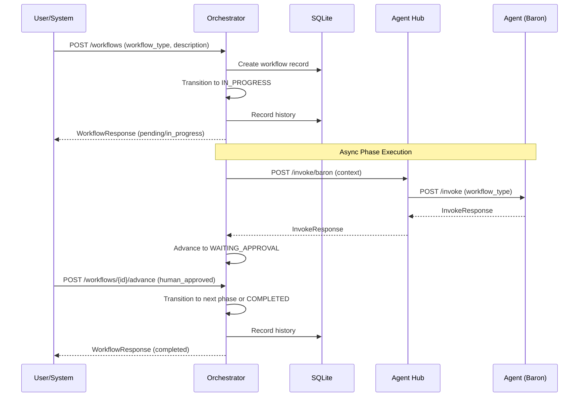

# SVC-001: Orchestrator Workflow Execution

**Domain**: Services Architecture (SVC)
**Priority**: P1 (MVP)
**Status**: Implemented

## Overview

Orchestrator manages SpecKit workflow execution, invoking agents exclusively through Agent Hub and maintaining workflow state in SQLite.

## User Story

> As a **user or external system**,
> I want to **trigger SpecKit workflows via the Orchestrator**,
> so that **I can execute specify, plan, tasks, and implement workflows with proper state management**.

## Journey Steps



### Step 1: Create Workflow

**Endpoint**: `POST /workflows`

**Request**:
```json
{
  "workflow_type": "specify",
  "feature_description": "Add user authentication with OAuth2 support",
  "context": {
    "priority": "P1",
    "requester": "product-team"
  }
}
```

**Response**:
```json
{
  "id": "550e8400-e29b-41d4-a716-446655440000",
  "workflow_type": "specify",
  "status": "in_progress",
  "feature_id": "009-add-user-authentication",
  "current_phase": "phase_1",
  "result": null,
  "created_at": "2026-01-05T12:00:00Z"
}
```

### Step 2: Get Workflow Status

**Endpoint**: `GET /workflows/{id}`

Track workflow progress during execution:

```json
{
  "id": "550e8400-e29b-41d4-a716-446655440000",
  "workflow_type": "specify",
  "status": "waiting_approval",
  "feature_id": "009-add-user-authentication",
  "current_phase": "phase_1",
  "result": {
    "output": "# Feature Specification...",
    "files_created": ["specs/009-add-user-auth/spec.md"]
  },
  "created_at": "2026-01-05T12:00:00Z",
  "updated_at": "2026-01-05T12:05:00Z"
}
```

### Step 3: Advance Workflow

**Endpoint**: `POST /workflows/{id}/advance`

Human approves phase result:

```json
{
  "trigger": "human_approved",
  "phase_result": {
    "approved": true,
    "comments": "LGTM, proceed to next phase"
  }
}
```

**Response**:
```json
{
  "id": "550e8400-e29b-41d4-a716-446655440000",
  "workflow_type": "specify",
  "status": "completed",
  "feature_id": "009-add-user-authentication",
  "current_phase": "phase_2",
  "result": {
    "output": "Specification complete",
    "files_created": ["specs/009-add-user-auth/spec.md"]
  },
  "completed_at": "2026-01-05T12:10:00Z"
}
```

## State Machine

```
PENDING → IN_PROGRESS (workflow started)
    │
    └── Agent processing...
        │
        └── IN_PROGRESS → WAITING_APPROVAL (agent complete)
                    │
                    ├── Human approves
                    │   └── WAITING_APPROVAL → IN_PROGRESS (next phase)
                    │                       or COMPLETED (all phases done)
                    │
                    └── Human rejects
                        └── WAITING_APPROVAL → IN_PROGRESS (rework)
                                            or FAILED (abort)

Any state → FAILED (error occurred)
```

## Workflow Types

| Type | Description | Agent |
|------|-------------|-------|
| specify | Generate feature specification | Baron |
| plan | Create implementation plan | Baron |
| tasks | Generate task breakdown | Baron |
| implement | Execute implementation | Baron |

## Success Criteria

| Criterion | Verification |
|-----------|--------------|
| Workflow creation | Returns valid UUID and feature_id |
| State tracking | Status updates correctly through lifecycle |
| Agent invocation | Routes through Agent Hub, not directly |
| History recording | All transitions recorded in workflow_history |
| Concurrent support | 10+ workflows can run simultaneously (SC-004) |
| Overhead | < 1 second added to total workflow time (SC-003) |

## Test Mapping

| Test Type | File | Description |
|-----------|------|-------------|
| Contract | `services/orchestrator/tests/contract/test_workflows.py` | POST /workflows contract |
| Contract | `services/orchestrator/tests/contract/test_get_workflow.py` | GET /workflows/{id} contract |
| Contract | `services/orchestrator/tests/contract/test_advance.py` | POST /workflows/{id}/advance contract |
| Integration | `services/orchestrator/tests/integration/test_state_machine.py` | State machine transitions |
| E2E | `tests/e2e/test_orchestrator_workflow.py` | Full journey with SVC-001 marker |

## Running Tests

```bash
# Contract tests
cd services/orchestrator
uv run pytest tests/contract/ -m contract

# Integration tests
uv run pytest tests/integration/ -m integration

# E2E tests (requires running services)
cd ../..
uv run pytest tests/e2e/test_orchestrator_workflow.py -m "e2e and journey"
```

## API Reference

### POST /workflows

Create and start a new workflow.

| Parameter | Type | Required | Description |
|-----------|------|----------|-------------|
| workflow_type | string | Yes | specify, plan, tasks, or implement |
| feature_description | string | Yes | Description (min 10 chars) |
| context | object | No | Additional context |

### GET /workflows/{workflow_id}

Get workflow by ID.

| Parameter | Type | Required | Description |
|-----------|------|----------|-------------|
| workflow_id | uuid (path) | Yes | Workflow UUID |

### POST /workflows/{workflow_id}/advance

Advance workflow to next state.

| Parameter | Type | Required | Description |
|-----------|------|----------|-------------|
| workflow_id | uuid (path) | Yes | Workflow UUID |
| trigger | string | Yes | agent_complete, human_approved, human_rejected |
| phase_result | object | No | Result from completed phase |

### GET /health

Get Orchestrator health status.

**Response**:
```json
{
  "status": "healthy",
  "version": "0.1.0",
  "uptime_seconds": 3600
}
```

## Configuration

| Environment Variable | Default | Description |
|---------------------|---------|-------------|
| DATABASE_URL | sqlite:///./data/orchestrator.db | SQLite database path |
| AGENT_HUB_URL | http://localhost:8000 | Agent Hub service URL |

## Related Documentation

- [Services Overview](../services/README.md)
- [Orchestrator Contract](../../specs/008-services-architecture/contracts/orchestrator.yaml)
- [SVC-002: Agent Consultation](./SVC-002-agent-consultation.md)
- [SVC-005: Stateless Agent](./SVC-005-stateless-agent.md)
