# SVC-002: Agent Consultation via Agent Hub

**Domain**: Services Architecture (SVC)
**Priority**: P1 (MVP)
**Status**: Implemented

## Overview

Agent Hub routes expert questions to appropriate agents based on topic, validates response confidence, and handles low-confidence escalation.

## User Story

> As an **Orchestrator or external service**,
> I want to **ask topic-based questions through Agent Hub**,
> so that **I can get expert answers with confidence validation and automatic escalation**.

## Journey Steps

```mermaid
sequenceDiagram
    participant O as Orchestrator
    participant H as Agent Hub
    participant A as Agent Service
    participant GH as GitHub (escalation)

    O->>H: POST /ask/{topic} (question, context)
    H->>H: Route topic → agent
    H->>A: POST /invoke (topic as workflow)
    A-->>H: InvokeResponse (answer, confidence)
    H->>H: Validate confidence
    alt Confidence >= threshold
        H-->>O: AskExpertResponse (status: resolved)
    else Confidence < threshold
        H->>GH: Create escalation issue
        H-->>O: AskExpertResponse (status: pending_human)
    end
```



### Step 1: Topic Routing

**Endpoint**: `POST /ask/{topic}`

**Request**:
```json
{
  "question": "Should we use JWT or session-based auth?",
  "context": "Building a multi-tenant SaaS application",
  "feature_id": "008-auth-system"
}
```

**Topic Routing**:
| Topic | Agent | Capabilities |
|-------|-------|--------------|
| architecture | baron | System design, patterns |
| security | charles | Auth, encryption, compliance |
| testing | marie | Test strategy, coverage |
| frontend | dali | UI/UX, React, accessibility |

### Step 2: Agent Invocation

Agent Hub invokes the routed agent:

```json
{
  "workflow_type": "architecture",
  "context": {
    "question": "Should we use JWT or session-based auth?",
    "topic": "architecture",
    "additional_context": "Building a multi-tenant SaaS application",
    "feature_id": "008-auth-system"
  }
}
```

### Step 3: Confidence Validation

Agent Hub validates the response confidence:

| Threshold | Topic | Action |
|-----------|-------|--------|
| 85% | Default | Escalate if below |
| 90% | security | Higher bar for security topics |
| 80% | testing | Slightly lower for test advice |

### Step 4: Response or Escalation

**High Confidence Response** (status: resolved):
```json
{
  "answer": "For a multi-tenant SaaS, JWT with short expiry and refresh tokens is recommended...",
  "rationale": "Based on your scalability needs and stateless architecture preference",
  "confidence": 92,
  "status": "resolved",
  "session_id": "550e8400-e29b-41d4-a716-446655440000"
}
```

**Low Confidence Response** (status: pending_human):
```json
{
  "answer": "I have some thoughts but need human verification...",
  "confidence": 72,
  "uncertainty_reasons": [
    "Compliance requirements unclear",
    "Integration constraints unknown"
  ],
  "status": "pending_human",
  "session_id": "550e8400-e29b-41d4-a716-446655440000",
  "escalation_id": "660e8400-e29b-41d4-a716-446655440001"
}
```

## Direct Agent Invocation

For direct agent control, use `/invoke/{agent}`:

**Endpoint**: `POST /invoke/{agent}`

**Request**:
```json
{
  "workflow_type": "specify",
  "context": {
    "feature_description": "User authentication system"
  },
  "parameters": {
    "priority": "P1"
  }
}
```

**Response**:
```json
{
  "success": true,
  "result": {
    "output": "# Feature Specification...",
    "files_created": ["specs/008-auth/spec.md"]
  },
  "confidence": 88,
  "metadata": {
    "duration_ms": 12500,
    "model_used": "claude-3-5-sonnet-20241022"
  }
}
```

## Success Criteria

| Criterion | Verification |
|-----------|--------------|
| Topic routing | Unknown topic returns 404 |
| Agent invocation | Forwards to correct agent |
| Confidence validation | Threshold checked per topic |
| Escalation creation | Low confidence triggers escalation |
| Error handling | Agent failures return proper errors |

## Test Mapping

| Test Type | File | Description |
|-----------|------|-------------|
| Contract | `services/agent-hub/tests/contract/test_invoke.py` | /invoke/{agent} contract |
| Contract | `services/agent-hub/tests/contract/test_ask.py` | /ask/{topic} contract |
| Integration | `services/agent-hub/tests/integration/test_confidence.py` | Confidence validation |
| E2E | `tests/e2e/test_agent_consultation.py` | Full journey with SVC-002 marker |

## Running Tests

```bash
# Contract tests
cd services/agent-hub
uv run pytest tests/contract/ -m contract

# Integration tests
uv run pytest tests/integration/ -m integration

# E2E tests (requires running services)
cd ../..
uv run pytest tests/e2e/test_agent_consultation.py -m "e2e and journey"
```

## API Reference

### POST /ask/{topic}

Ask an expert by topic.

| Parameter | Type | Required | Description |
|-----------|------|----------|-------------|
| topic | string (path) | Yes | Topic for routing |
| question | string | Yes | Question to ask (min 10 chars) |
| context | string | No | Additional context |
| feature_id | string | Yes | Feature ID for logging |
| session_id | uuid | No | Session for multi-turn |

### POST /invoke/{agent}

Invoke a specific agent.

| Parameter | Type | Required | Description |
|-----------|------|----------|-------------|
| agent | string (path) | Yes | Agent name |
| workflow_type | string | Yes | Workflow type |
| context | object | Yes | Context for workflow |
| parameters | object | No | Additional parameters |
| session_id | uuid | No | Optional session ID |

### GET /health

Get Agent Hub health status.

**Response**:
```json
{
  "status": "healthy",
  "version": "0.1.0",
  "uptime_seconds": 3600,
  "connected_agents": ["baron", "duc", "marie"]
}
```

## Related Documentation

- [Services Overview](../services/README.md)
- [Agent Hub Architecture](../architecture/agent-hub.md)
- [Agent Hub Contract](../../specs/008-services-architecture/contracts/agent-hub.yaml)
- [SVC-005: Stateless Agent](./SVC-005-stateless-agent.md)
