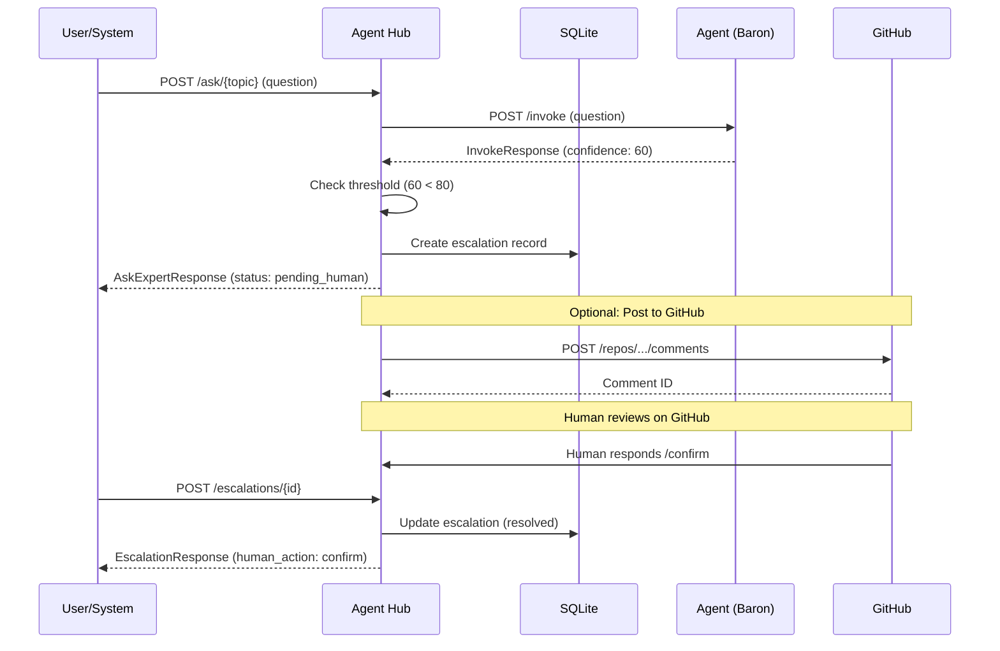

# SVC-003: Human Escalation

**Domain**: Services Architecture (SVC)
**Priority**: P1
**Status**: Implemented

## Overview

Agent Hub escalates low-confidence responses for human review. When an agent's confidence is below the threshold, an escalation is created and optionally posted to GitHub for human input.

## User Story

> As a **system administrator**,
> I want to **review agent responses that are uncertain**,
> so that **I can ensure accuracy for critical decisions**.

## Journey Steps



### Step 1: Question Triggers Escalation

**Endpoint**: `POST /ask/{topic}`

**Request**:
```json
{
  "question": "Should we use microservices or monolith for this startup?",
  "feature_id": "008-architecture-decision"
}
```

**Response** (low confidence):
```json
{
  "answer": "Based on your startup context, I recommend...",
  "confidence": 60,
  "uncertainty_reasons": [
    "Trade-offs depend heavily on team size and experience",
    "Future scaling needs are unclear"
  ],
  "status": "pending_human",
  "session_id": "550e8400-e29b-41d4-a716-446655440000",
  "escalation_id": "7c9e6679-7425-40de-944b-e07fc1f90ae7"
}
```

### Step 2: Get Escalation Details

**Endpoint**: `GET /escalations/{id}`

**Response**:
```json
{
  "id": "7c9e6679-7425-40de-944b-e07fc1f90ae7",
  "status": "pending",
  "question": "Should we use microservices or monolith for this startup?",
  "tentative_answer": "Based on your startup context, I recommend...",
  "confidence": 60,
  "uncertainty_reasons": [
    "Trade-offs depend heavily on team size and experience",
    "Future scaling needs are unclear"
  ],
  "human_action": null,
  "human_response": null,
  "human_responder": null,
  "created_at": "2026-01-05T12:00:00Z",
  "resolved_at": null
}
```

### Step 3: Human Submits Response

**Endpoint**: `POST /escalations/{id}`

**Request** (confirm):
```json
{
  "action": "confirm",
  "responder": "@jane"
}
```

**Request** (correct):
```json
{
  "action": "correct",
  "response": "Start with a modular monolith. Your 3-person team will benefit from simpler deployment and debugging.",
  "responder": "@jane"
}
```

**Request** (add context):
```json
{
  "action": "add_context",
  "response": "We expect to reach 1M users in 6 months and have 10 engineers joining.",
  "responder": "@jane"
}
```

**Response**:
```json
{
  "id": "7c9e6679-7425-40de-944b-e07fc1f90ae7",
  "status": "resolved",
  "question": "Should we use microservices or monolith for this startup?",
  "tentative_answer": "Based on your startup context, I recommend...",
  "confidence": 60,
  "uncertainty_reasons": [
    "Trade-offs depend heavily on team size and experience",
    "Future scaling needs are unclear"
  ],
  "human_action": "correct",
  "human_response": "Start with a modular monolith...",
  "human_responder": "@jane",
  "created_at": "2026-01-05T12:00:00Z",
  "resolved_at": "2026-01-05T14:30:00Z"
}
```

## Human Actions

| Action | Description | Response Required |
|--------|-------------|-------------------|
| confirm | Accept the tentative answer as correct | No |
| correct | Provide the correct answer | Yes |
| add_context | Add more information for re-evaluation | Yes |

## Confidence Thresholds

| Topic | Threshold | Description |
|-------|-----------|-------------|
| security | 95% | Security decisions require high confidence |
| compliance | 95% | Compliance advice needs certainty |
| default | 80% | General topics |

## Escalation States

| State | Description |
|-------|-------------|
| pending | Awaiting human review |
| resolved | Human has responded |
| expired | Escalation expired without response |

## GitHub Integration (Optional)

When configured, escalations can be posted as GitHub issue comments:

```markdown
## Human Review Required

**Confidence:** 60%

### Question
Should we use microservices or monolith for this startup?

### Tentative Answer
Based on your startup context, I recommend...

### Uncertainty Reasons
- Trade-offs depend heavily on team size and experience
- Future scaling needs are unclear

### How to Respond

Reply to this comment with one of the following:

- `/confirm` - Accept the tentative answer as correct
- `/correct <your answer>` - Provide the correct answer
- `/context <additional info>` - Add more context for re-evaluation

---
_Escalation ID: 7c9e6679-7425-40de-944b-e07fc1f90ae7_
```

## Success Criteria

| Criterion | Verification |
|-----------|--------------|
| Low confidence triggers escalation | Responses below threshold create escalation (SC-007) |
| Escalation persisted | Escalation stored in database |
| Human can respond | POST /escalations/{id} updates status |
| Response types supported | confirm, correct, add_context all work |
| Already resolved handled | Resubmitting returns 409 Conflict |

## Test Mapping

| Test Type | File | Description |
|-----------|------|-------------|
| Contract | `services/agent-hub/tests/contract/test_escalations_get.py` | GET /escalations/{id} |
| Contract | `services/agent-hub/tests/contract/test_escalations_respond.py` | POST /escalations/{id} |
| Integration | `services/agent-hub/tests/integration/test_escalation_create.py` | Escalation creation |
| Integration | `services/agent-hub/tests/integration/test_github_escalation.py` | GitHub comment posting |
| E2E | `tests/e2e/test_human_escalation.py` | Full journey with SVC-003 marker |

## Running Tests

```bash
# Contract tests
cd services/agent-hub
uv run pytest tests/contract/test_escalations*.py -m contract

# Integration tests
uv run pytest tests/integration/test_escalation*.py tests/integration/test_github*.py -m integration

# E2E tests (requires running services)
cd ../..
uv run pytest tests/e2e/test_human_escalation.py -m "e2e and journey"
```

## API Reference

### GET /escalations/{escalation_id}

Get escalation by ID.

| Parameter | Type | Required | Description |
|-----------|------|----------|-------------|
| escalation_id | uuid (path) | Yes | Escalation UUID |

**Response Codes**:
- 200: Escalation found
- 400: Invalid UUID format
- 404: Escalation not found

### POST /escalations/{escalation_id}

Submit human response to escalation.

| Parameter | Type | Required | Description |
|-----------|------|----------|-------------|
| escalation_id | uuid (path) | Yes | Escalation UUID |
| action | string (body) | Yes | confirm, correct, or add_context |
| response | string (body) | For correct | The correct answer |
| responder | string (body) | Yes | Human identifier (@username) |

**Response Codes**:
- 200: Response accepted
- 400: Invalid action or missing required fields
- 404: Escalation not found
- 409: Already resolved

## Configuration

| Environment Variable | Default | Description |
|---------------------|---------|-------------|
| GITHUB_TOKEN | - | GitHub API token for posting comments |
| GITHUB_REPO | farmer1st/farmer-code | Repository for escalation comments |
| ESCALATION_THRESHOLD | 80 | Default confidence threshold |

## Related Documentation

- [Services Overview](../services/README.md)
- [Agent Hub Contract](../../specs/008-services-architecture/contracts/agent-hub.yaml)
- [SVC-002: Agent Consultation](./SVC-002-agent-consultation.md)
- [SVC-004: Multi-Turn Session](./SVC-004-multi-turn-session.md)
