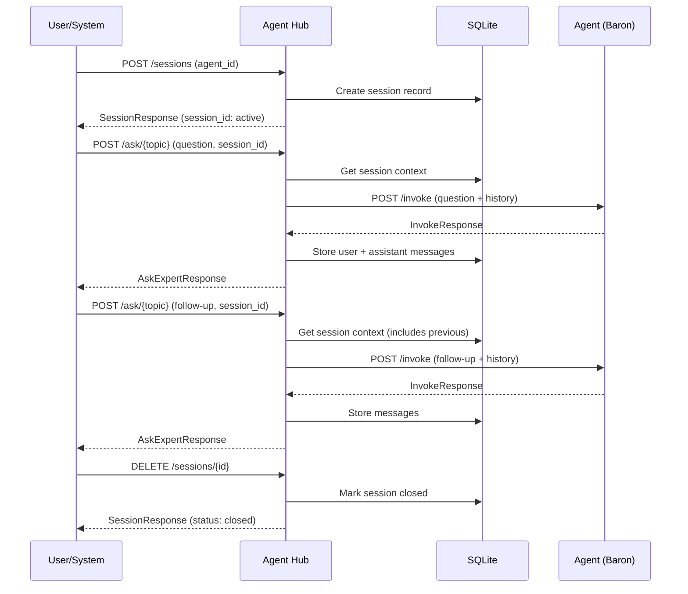

# SVC-004: Multi-Turn Session

**Domain**: Services Architecture (SVC)
**Priority**: P2
**Status**: Implemented

## Overview

Agent Hub maintains session state for multi-turn conversations, preserving context across exchanges to enable coherent follow-up questions.

## User Story

> As a **user or external system**,
> I want to **have multi-turn conversations with agents**,
> so that **I can ask follow-up questions without repeating context**.

## Journey Steps



### Step 1: Create Session

**Endpoint**: `POST /sessions`

**Request**:
```json
{
  "agent_id": "@baron",
  "feature_id": "008-auth-system"
}
```

**Response**:
```json
{
  "id": "550e8400-e29b-41d4-a716-446655440000",
  "agent_id": "@baron",
  "feature_id": "008-auth-system",
  "status": "active",
  "created_at": "2026-01-05T12:00:00Z",
  "updated_at": "2026-01-05T12:00:00Z"
}
```

### Step 2: First Exchange

**Endpoint**: `POST /ask/{topic}`

**Request**:
```json
{
  "question": "I'm building a user authentication system with OAuth2",
  "feature_id": "008-auth-system",
  "session_id": "550e8400-e29b-41d4-a716-446655440000"
}
```

**Response**:
```json
{
  "answer": "For OAuth2 authentication, I recommend...",
  "confidence": 88,
  "status": "resolved",
  "session_id": "550e8400-e29b-41d4-a716-446655440000"
}
```

### Step 3: Follow-Up Exchange

**Request**:
```json
{
  "question": "Given what I just said, should I use JWT or sessions?",
  "feature_id": "008-auth-system",
  "session_id": "550e8400-e29b-41d4-a716-446655440000"
}
```

The agent receives the previous conversation context automatically.

### Step 4: Get Session History

**Endpoint**: `GET /sessions/{id}`

**Response**:
```json
{
  "id": "550e8400-e29b-41d4-a716-446655440000",
  "agent_id": "@baron",
  "status": "active",
  "messages": [
    {
      "id": "msg-1",
      "role": "user",
      "content": "I'm building a user authentication system with OAuth2",
      "created_at": "2026-01-05T12:00:00Z"
    },
    {
      "id": "msg-2",
      "role": "assistant",
      "content": "For OAuth2 authentication, I recommend...",
      "metadata": {"confidence": 88},
      "created_at": "2026-01-05T12:00:05Z"
    },
    {
      "id": "msg-3",
      "role": "user",
      "content": "Given what I just said, should I use JWT or sessions?",
      "created_at": "2026-01-05T12:01:00Z"
    },
    {
      "id": "msg-4",
      "role": "assistant",
      "content": "Based on your OAuth2 setup, JWT tokens would be...",
      "metadata": {"confidence": 92},
      "created_at": "2026-01-05T12:01:10Z"
    }
  ]
}
```

### Step 5: Close Session

**Endpoint**: `DELETE /sessions/{id}`

**Response**:
```json
{
  "id": "550e8400-e29b-41d4-a716-446655440000",
  "agent_id": "@baron",
  "status": "closed",
  "created_at": "2026-01-05T12:00:00Z",
  "updated_at": "2026-01-05T12:05:00Z"
}
```

## Session States

| State | Description |
|-------|-------------|
| active | Session is available for exchanges |
| closed | Session manually closed, history preserved |
| expired | Session expired due to inactivity (1 hour default) |

## Success Criteria

| Criterion | Verification |
|-----------|--------------|
| Context preservation | Previous messages included in agent context (SC-006) |
| 5+ exchanges | Session supports at least 5 consecutive exchanges |
| Independent sessions | Multiple sessions don't interfere |
| Audit preservation | Closed sessions retain message history |
| Expired handling | Expired sessions reject new messages |

## Test Mapping

| Test Type | File | Description |
|-----------|------|-------------|
| Contract | `services/agent-hub/tests/contract/test_sessions_create.py` | POST /sessions |
| Contract | `services/agent-hub/tests/contract/test_sessions_get.py` | GET /sessions/{id} |
| Contract | `services/agent-hub/tests/contract/test_sessions_close.py` | DELETE /sessions/{id} |
| Integration | `services/agent-hub/tests/integration/test_session_context.py` | Context preservation |
| E2E | `tests/e2e/test_multi_turn_session.py` | Full journey with SVC-004 marker |

## Running Tests

```bash
# Contract tests
cd services/agent-hub
uv run pytest tests/contract/test_sessions*.py -m contract

# Integration tests
uv run pytest tests/integration/test_session_context.py -m integration

# E2E tests (requires running services)
cd ../..
uv run pytest tests/e2e/test_multi_turn_session.py -m "e2e and journey"
```

## API Reference

### POST /sessions

Create a new session.

| Parameter | Type | Required | Description |
|-----------|------|----------|-------------|
| agent_id | string | Yes | Agent identifier (e.g., @baron) |
| feature_id | string | No | Feature ID for grouping |

### GET /sessions/{session_id}

Get session with message history.

| Parameter | Type | Required | Description |
|-----------|------|----------|-------------|
| session_id | uuid (path) | Yes | Session UUID |

### DELETE /sessions/{session_id}

Close a session (preserves history).

| Parameter | Type | Required | Description |
|-----------|------|----------|-------------|
| session_id | uuid (path) | Yes | Session UUID |

## Configuration

| Environment Variable | Default | Description |
|---------------------|---------|-------------|
| DATABASE_URL | sqlite:///./data/agent-hub.db | Database path |
| SESSION_EXPIRY_HOURS | 1 | Session expiry time |

## Related Documentation

- [Services Overview](../services/README.md)
- [Agent Hub Contract](../../specs/008-services-architecture/contracts/agent-hub.yaml)
- [SVC-002: Agent Consultation](./SVC-002-agent-consultation.md)
