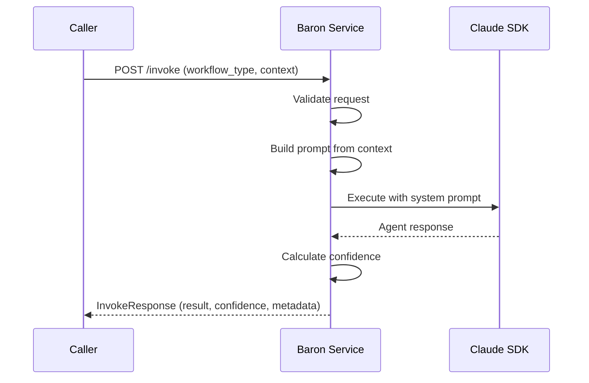

# SVC-005: Stateless Agent Invocation

**Domain**: Services Architecture (SVC)
**Priority**: P1 (MVP)
**Status**: Implemented

## Overview

Baron agent service receives requests with all context, processes via Claude SDK, and returns complete response without maintaining server-side state.

## User Story

> As a **calling service (Agent Hub or Orchestrator)**,
> I want to **invoke Baron with complete context in each request**,
> so that **I can get workflow outputs without managing agent state**.

## Journey Steps



### Step 1: Request Validation

**Endpoint**: `POST /invoke`

**Request**:
```json
{
  "workflow_type": "specify",
  "context": {
    "feature_description": "Add user authentication with OAuth2"
  },
  "parameters": {
    "priority": "P1"
  }
}
```

**Validation**:
- `workflow_type` must be one of: specify, plan, tasks, implement
- `context` must be non-empty
- `parameters` is optional

### Step 2: Prompt Building

Baron constructs prompts from context:

1. **System prompt**: Workflow-specific instructions
2. **User prompt**: Context formatted as markdown

### Step 3: SDK Execution

Baron invokes Claude Code SDK:
- Uses workflow-specific system prompt
- Passes formatted context as user prompt
- Collects streaming response

### Step 4: Response

**Response**:
```json
{
  "success": true,
  "result": {
    "output": "# Feature Specification...",
    "files_created": ["specs/001-auth/spec.md"]
  },
  "confidence": 92,
  "metadata": {
    "duration_ms": 15234,
    "model_used": "claude-3-5-sonnet-20241022"
  }
}
```

## Success Criteria

| Criterion | Verification |
|-----------|--------------|
| Stateless | No session storage on server |
| Complete context | All info passed in request |
| Independent requests | Parallel requests don't interfere |
| Proper errors | 400 for bad request, 500 for failures |

## Test Mapping

| Test Type | File | Description |
|-----------|------|-------------|
| Contract | `services/agents/baron/tests/contract/test_invoke.py` | API contract validation |
| Contract | `services/agents/baron/tests/contract/test_health.py` | Health endpoint validation |
| Integration | `services/agents/baron/tests/integration/test_stateless.py` | Stateless behavior |
| E2E | `tests/e2e/test_baron_stateless.py` | Full journey with SVC-005 marker |

## Running Tests

```bash
# Contract tests
cd services/agents/baron
uv run pytest tests/contract/ -m contract

# Integration tests
uv run pytest tests/integration/ -m integration

# E2E tests (requires running service)
cd ../../..
uv run pytest tests/e2e/test_baron_stateless.py -m "e2e and journey"
```

## API Reference

### POST /invoke

Invoke Baron with a workflow request.

| Parameter | Type | Required | Description |
|-----------|------|----------|-------------|
| workflow_type | string | Yes | specify, plan, tasks, or implement |
| context | object | Yes | Context for the workflow |
| parameters | object | No | Additional parameters |
| session_id | uuid | No | Optional session ID for logging |

### GET /health

Get Baron health status.

**Response**:
```json
{
  "status": "healthy",
  "version": "0.1.0",
  "agent_name": "baron",
  "capabilities": {
    "workflow_types": ["specify", "plan", "tasks", "implement"],
    "tools": ["Read", "Write", "Glob", "Grep", "Edit"]
  }
}
```

## Related Documentation

- [Services Overview](../services/README.md)
- [Baron Agent](../services/agents/baron.md)
- [Agent Service Contract](../../specs/008-services-architecture/contracts/agent-service.yaml)
