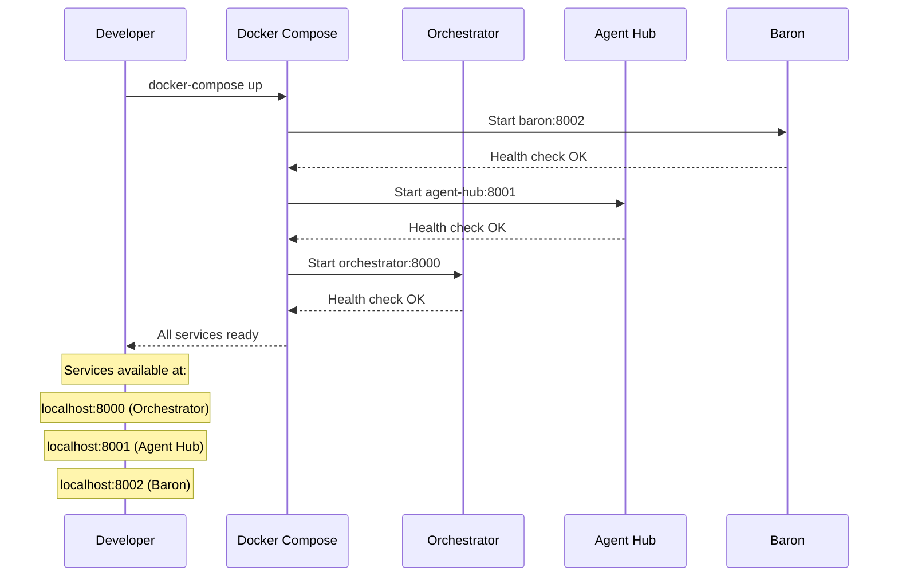

# SVC-006: Local Development Setup

**Domain**: Services Architecture (SVC)
**Priority**: P3
**Status**: Implemented

## Overview

Developers can start all Farmer Code services locally with a single command using Docker Compose. This enables rapid development and testing of the complete service stack.

## User Story

> As a **developer**,
> I want to **start all services with a single command**,
> so that **I can develop and test the complete system locally**.

## Journey Steps



### Step 1: Clone and Setup

```bash
# Clone the repository
git clone https://github.com/farmer1st/farmer-code.git
cd farmer-code

# Copy environment template
cp .env.example .env

# Edit .env with your API keys
# Required: ANTHROPIC_API_KEY
```

### Step 2: Start All Services

**Production mode** (optimized, no hot reload):
```bash
docker-compose up
```

**Development mode** (with hot reload):
```bash
docker-compose -f docker-compose.dev.yml up
```

### Step 3: Verify Services

All services should be healthy within 60 seconds:

```bash
# Check Orchestrator
curl http://localhost:8000/health
# {"status": "healthy", "service": "orchestrator"}

# Check Agent Hub
curl http://localhost:8001/health
# {"status": "healthy", "service": "agent-hub"}

# Check Baron
curl http://localhost:8002/health
# {"status": "healthy", "service": "baron"}
```

### Step 4: Test Workflow

```bash
# Create a workflow via Orchestrator
curl -X POST http://localhost:8000/workflows \
  -H "Content-Type: application/json" \
  -d '{
    "workflow_type": "specify",
    "feature_id": "test-feature",
    "context": {"feature_description": "Test feature"}
  }'
```

## Service Ports

| Service | Port | Description |
|---------|------|-------------|
| Orchestrator | 8000 | Workflow state management |
| Agent Hub | 8001 | Central agent coordination |
| Baron | 8002 | PM Agent (specify, plan, tasks) |

## Service Dependencies

```
Baron (8002)
    ↑
Agent Hub (8001)
    ↑
Orchestrator (8000)
```

Services start in dependency order:
1. Baron starts first (no dependencies)
2. Agent Hub starts after Baron is healthy
3. Orchestrator starts after Agent Hub is healthy

## Environment Variables

Required in `.env`:

| Variable | Description |
|----------|-------------|
| ANTHROPIC_API_KEY | Claude API key for Baron agent |

Optional:

| Variable | Default | Description |
|----------|---------|-------------|
| GITHUB_TOKEN | - | GitHub token for escalation comments |
| GITHUB_REPO | farmer1st/farmer-code | Repository for escalations |

## Development Mode Features

The `docker-compose.dev.yml` configuration includes:

- **Hot reload**: Code changes reflect immediately
- **Debug logging**: Verbose log output
- **Volume mounts**: Local source code mounted into containers

```bash
# Start in development mode
docker-compose -f docker-compose.dev.yml up

# Rebuild after dependency changes
docker-compose -f docker-compose.dev.yml up --build
```

## Common Commands

```bash
# Start all services (background)
docker-compose up -d

# View logs
docker-compose logs -f

# View logs for specific service
docker-compose logs -f agent-hub

# Stop all services
docker-compose down

# Stop and remove volumes (fresh start)
docker-compose down -v

# Rebuild images
docker-compose build

# Restart specific service
docker-compose restart agent-hub
```

## Troubleshooting

### Services fail to start

Check that ports are not in use:
```bash
lsof -i :8000
lsof -i :8001
lsof -i :8002
```

### Health checks failing

View service logs:
```bash
docker-compose logs orchestrator
docker-compose logs agent-hub
docker-compose logs baron
```

### Database issues

Reset volumes for fresh start:
```bash
docker-compose down -v
docker-compose up
```

## Success Criteria

| Criterion | Verification |
|-----------|--------------|
| Start within 60 seconds | `time docker-compose up` < 60s (SC-001) |
| All services healthy | All `/health` endpoints return 200 |
| Services communicate | Workflow flows through all services |

## Test Mapping

| Test Type | File | Description |
|-----------|------|-------------|
| E2E | `tests/e2e/test_docker_compose.py` | Full Docker Compose journey with SVC-006 marker |

## Running Tests

```bash
# Run Docker Compose E2E tests (requires Docker)
uv run pytest tests/e2e/test_docker_compose.py -m "e2e and journey" -v

# Run file existence tests only (no Docker needed)
uv run pytest tests/e2e/test_docker_compose.py::TestDockerComposeWithoutDocker -v
```

## Related Documentation

- [Quickstart Guide](../getting-started/quickstart.md)
- [Services Overview](../services/README.md)
- [Orchestrator Service](../services/orchestrator.md)
- [Agent Hub Service](../services/agent-hub.md)
